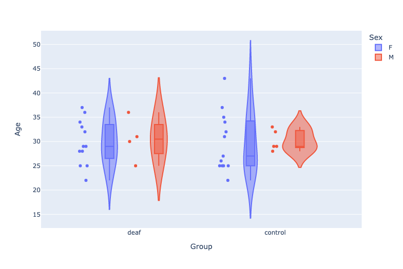
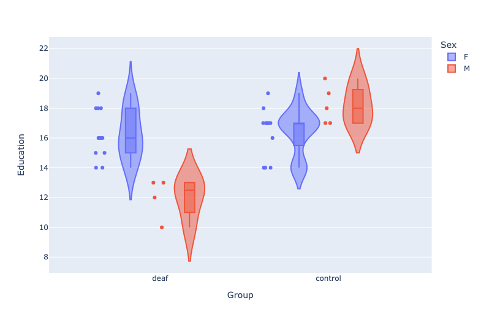
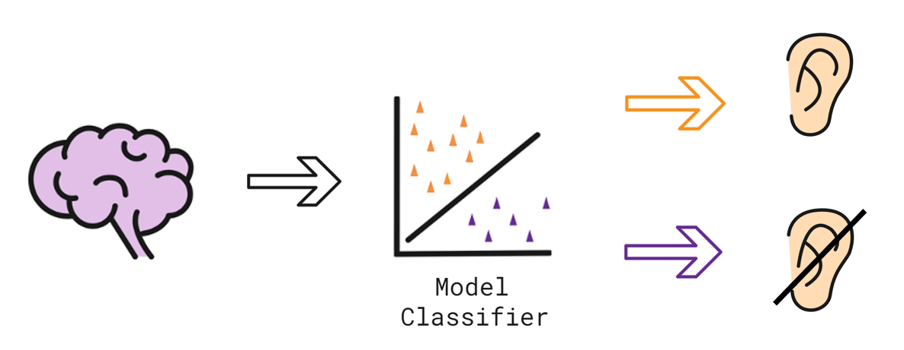
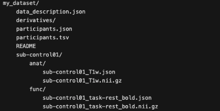
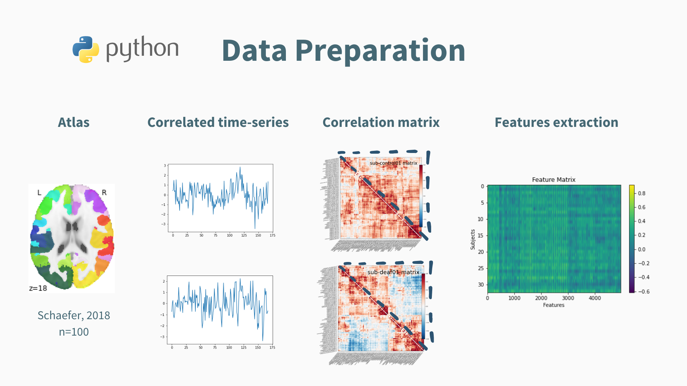
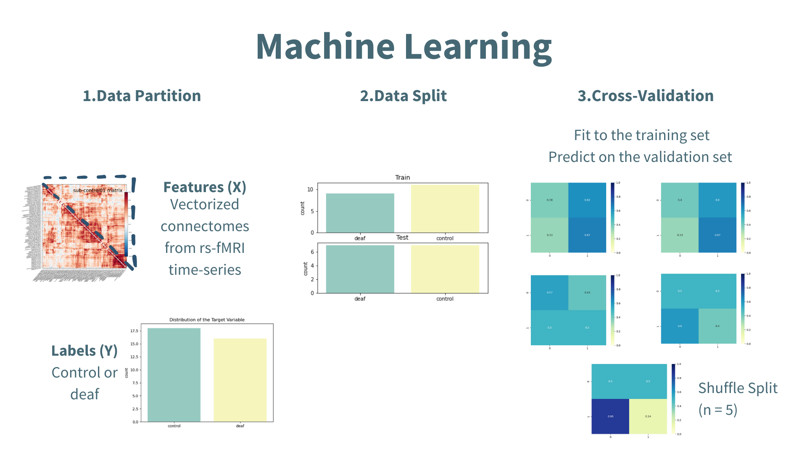

<!-- This is an html comment and this won't appear in the rendered page. You are now editing the "content" area, the core of your description. Everything that you can do in markdown is allowed below. We added a couple of comments to guide your through documenting your progress. -->

# About me

[Catherine Landry (she/her)](https://github.com/catherinelandry)

Hello! I am currently doing my master's degree in psychology at the University of Montreal. My wide range of interests is reflected through my eclectic research background. I have worked with children at Sainte-Justine Hospital, trained spinal cord injured rats, and I am now doing research on individuals living with deafness. As of today, I'm particularly hyped about neuroimaging and coding, hence my learning journey with PSY6983.

# Project Definition

## Background

Functional connectivity can be studied at different resolutions, scaling from locally functional areas to large and spatially distributed networks. At rest, brain regions with correlated temporal patterns with each other form resting state networks (RSN). Sensory deprivation leads to functional changes in the brain beyond the affected sensory modality. Various studies have found altered RSN in deaf individuals compared to controls (e.g. [Bonna et al., 2020](https://doi.org/10.1007/s11682-020-00346-y ); [Ducas et al., 2021](https://doi.org/10.21203/rs.3.rs-246296/v1)). Supervised machine learning can yield characterization of rs-fMRI for individual-level predictions ([Khosla et al., 2019](https://doi.org/10.1016/j.mri.2019.05.031)). Therefore, it would be interesting to predict whether a participant is hearing or not based on a functional connectivity estimation.

### Main objectives:

* Learn reproductible neuroimaging workflow from preprocessing to data visualization to equip myself with open science tools for future neuroimaging projects.  

* Determine the most contributing features in machine learning prediction at single-participant level and interpret the weight of the coefficients according to the RSN.  

### Personal objectives set for the course:

* Familiarize myself with open science software and its best practices

* Learn how to code with python, specifically for the neuroimaging field   

* Have a better understanding of machine learning and its application in neuroimaging

## Tools

All the tools used for the project:

* Bash Terminal

* Visual Studio Code

* Jupyter Notebook  

* Git and Github for version control

* BIDS for data management

* fMRIPrep for data preprocessing

* [`matplotlib`](https://matplotlib.org/), [`seaborn`](https://seaborn.pydata.org/), and [`plotly`](https://plotly.com/) for data visualization

* [`scikit-learn`](https://scikit-learn.org/stable/) for machine learning and [`nilearn`](https://nilearn.github.io/) for neuroimaging data manipulations

## Data

The dataset comprises 5-minutes fMRI resting state images covering the whole brain of 34 adult participants, 16 of which have severe-to-profound prelingual deafness and 18 of which are hearing individuals that serve as controls. All participants were instructed to lie still and to avoid holding on to thoughts for the duration of the scanning.

**Age Distribution Across the Participants** (Click **[here](https://catherinelandry.github.io/interactive_plot/age_description.html)** for an interactive plot!)

**Education Distribution Across the Participants** (Click **[here](https://catherinelandry.github.io/interactive_plot/education_description.html)** for an interactive plot!)

For further questions on the dataset and the acquisition parameters, I encourage you to reach out to me at cath.landry2@gmail.com

## Deliverables

At the end of this project, I will have:

* Markdown file for the project repository
* requirements.txt that lists all the packages used in the project
* Jupiter notebooks for the presentation slides and data visualization
* Python scripts for data prep and machine learning

# Results

## Progress Overview

This project was initiated as part of the course PSY6983. The following sections detail the different steps taken to achieve the deliverables of the project.

  Source: Illustration created with Selman Design taken in Autodraw under the license CC BY 4.0 

## 1. Data Management

Since my data was converted from DICOM to NIfTI prior to the beggining of the course, the first phase of the project was dedicated to organize my dataset into the BIDS format. This standardized neuroimaging structure enables the [FAIR guidelines](https://www.go-fair.org/fair-principles/) criteria of interoperability (I) and reusability (R), which corresponds with my objective to familiarize myself with the best practices in data management. Different tutorials and examples available in Github repos facilitated the BIDS conversion (see [bids-starter-kit](https://github.com/bids-standard/bids-starter-kit)). [BIDS Validator](https://bids-standard.github.io/bids-validator/) web browser based version confirmed that the data structure matched the BIDS standards.

## 2. Data Preprocessing

- Step 1. The Open-access [fMRIPrep](https://fmriprep.org/en/stable/index.html) pipeline was used for minimal preprocessing.

- Step 2. [Load_confounds](https://github.com/catherinelandry/load_confounds) was installed and added to the data prep script as part of my denosing strategy.

## 3. Data Preparation

The Schaefer atlas (2018) was employed with dimension selection set at 100 ROI. Pairwise correlated time series were extracted to form a correlation matrix.

*Note: the matrix contains redondant information, such as the pairs (i, j) and (j, i), which can bias the classification. Therefore, only the vectorized matrix of each participant was extracted and fed to the classifier.*

## 4. Machine Learning

A pipeline was used to facilitate hyper-parameters tuning for model optimization. It includes:
- Standardization (StandardScaler)
- Dimensionality Reduction (PCA)
- Model Selection (linear SVC)
- Regularization Parameter (C)

The following figure portrays the machine learning script:   

### Accuracy Scores

|             |     Mean     |      Std     |
|-------------|:------------:|:------------:|
|Train        |     1.0      |      0.0     |  
|Validation   |     0.45     |      0.1     |
|Test (fit on validation) |     0.56     |      0.0     |
|Test (fit on train + validation) |     1.0      |      0.0     |

### Interpretation

Using a vectorized correlation matrix was not successful to classify whether the participant was hearing or not. The prediction is close to chance level when fitting the data on the validation set only and overfits when fitting the data on the whole training set (including the validation one). Many reasons could explain these results (e.g. model/hyper-parameters/features selection, sample size, intra-individual differences, etc.). Predifining ROI known to show differences between the two groups instead of using the whole brain might also improve the prediction at the single-level.

But on a good note...

The most contributing coefficients to the classifier can be visualized on the brain!   

## Tools Learned During This Project

- **Open Science Software:** I learned to use Git for local and remote control in order to share my project repository on Github. I was also able to navigate through different repositories to find the documentation needed for my project. Data organization, preprocessing and denoising strategies only used open access tools for reproductibility.

- **Machine Learning Packages:** I have a better understanding of how to use `scikit-learn`, `nilearn` and their different modules for machine learning and neuroimaging data manipulations.  

- **Python Scripting:** I was able to use different librairies (e.g. `numpy`, `nibabel`), code in a virtual environment with Jupyter Notebook and edit code with Virtual Studio Code. The course modules helped me understand data dimensionality and how to manipulate it.

- **Data Visualization:** I learned to plot static figures with `matplotlib` and `seaborn` and to generate interactive figures with `plotly`. I am now able to code this cool brain visualization:

## Deliverables

By the end of the project, I was able to deliver:

- [README.md](https://github.com/PSY6983-2021/clandry_project): markdown file that documents the present project
- The following python scripts:
	1. [Data Prep](https://github.com/PSY6983-2021/clandry_project/tree/main/codes): script that loads the nifti data, applies a masker and extracts features
	2. [Linear SVC](https://github.com/PSY6983-2021/clandry_project/tree/main/codes): script with preprocessing and machine learning classifier
- The following Jupyter notebooks:
	1. [Presentation slides](https://github.com/PSY6983-2021/clandry_project/tree/main/notebooks): can be launched with the Rise extension
	2. [Data visualization](https://github.com/PSY6983-2021/clandry_project/tree/main/notebooks): code that plots the static and interactive figures in the repo. This notebook was conceptualized to run specific code cells that import the python scripts needed to retrieve the data
- The requirements.txt: file with all the prerequisite packages used to run the codes      

# Conclusion and Acknowledgement

The past month has been very educational and rewarding on many levels. The course format allowed for the application of new knowledge to a project that reflects my interests. While it was easy to get lost in ideas of grandeur for the project, I reached most of the goals I set for myself, notably a better understanding of neuroimaging data manipulations using open science tools and practices.  

The classification perfomance outcomes illustrate the need for further investigation on single-level prediction and features' importance. The vectorize correlation matrix was not a good discriminating feature between hearing and non hearing individuals. Although the results were not striking, I emerge of this experience equipped with improved coding skills and fueled with new ideas to try on my model.

A special thanks to Pierre Bellec for his advice and his insightful takes about the future of science practices. I would have been stuck longer on data preprocessing without Desiree's help and might have shed a tear without Andreanne's and François' coding skills. You have all facilitated my learning journey and provided me with the necessary tools to overcome obstacles. A great thanks to Marie-Eve with whom I shared (lots of) coffees during our coding sessions.

# References

Bonna, K., Finc, K., Zimmermann, M., Bola, L., Mostowski, P., Szul, M., Rutkowski, P., Duch, W., Marchewka, A., Jednorog, K., & Szwed, M. (2020). Early deafness leads to re-shaping of functional connectivity beyond the auditory cortex. Brain Imaging and Behavior, 1-14. https://doi.org/10.1007/s11682-020-00346-y

Ducas, K. D., Senra Filho, A. C. D. S., Silva, P. H. R., Secchinato, K. F., Leoni, R. F., & Santos, A. C. (2021). Functional and structural brain connectivity in congenital deafness. Brain Structure and Function, 226(4), 1323-1333. https://doi.org/10.21203/rs.3.rs-246296/v1

Khosla, M., Jamison, K., Ngo, G. H., Kuceyeski, A., & Sabuncu, M. R. (2019). Machine learning in resting-state fMRI analysis. Magnetic resonance imaging, 64, 101-121. https://doi.org/10.1016/j.mri.2019.05.031
