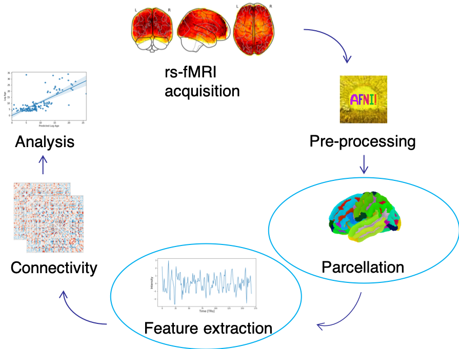
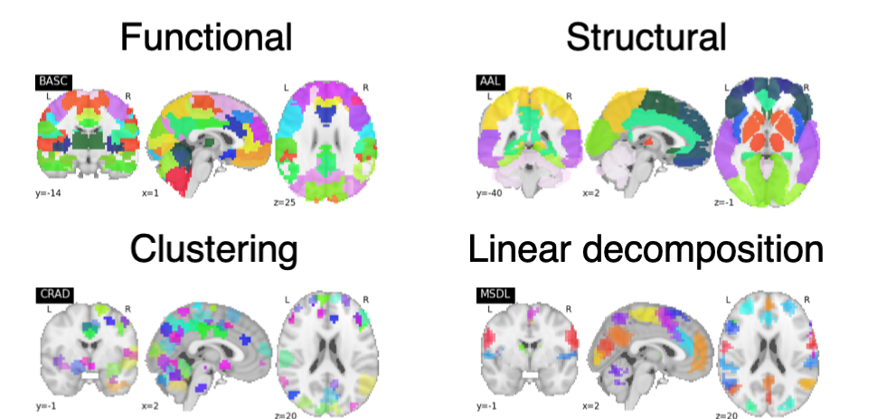
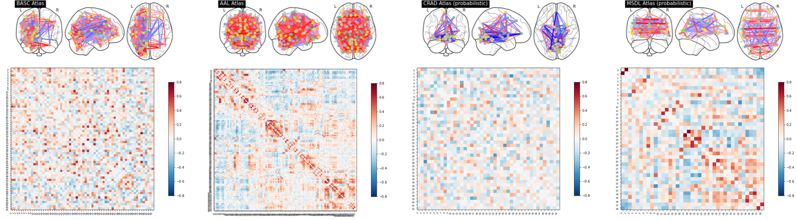

<!-- This is an html comment and this won't appear in the rendered page. You are now editing the "content" area, the core of your description. Everything that you can do in markdown is allowed below. We added a couple of comments to guide your through documenting your progress. -->

## Project definition

### Background

I am a third year PhD student at Polytechnique with a background in MRI. My primary goal for this project is to become more proficient with tools that further open, reproducible science. Even the most valiant attempts at sharing data and code can fall short in terms of reproducibility, so I aim to incorporate multiple tools and strategies to promote the reliable reproducibility of this project.

One important source of variability across studies is a lack of standardization in preprocessing steps. This project will focus on the effect that preprocessing choices may have on the prediction performance of a machine learning model. Specifically, two preprocessing steps that affect the extraction of functional signal will be examined: atlas choice and confound removal.

 

Four different atlases will be used: functional (BASC multiscale)2,3, structural (AAL)4, clustering method (Craddock)5, and linear decomposition (MSDL)6.

 

 Various confound inclusion/exclusion options will be explored, including cerebral spinal fluid (CSF) signal, white matter (WM) signal, global signal, and motion correction.

The impact of these choices will be assessed by evaluating the prediction performance of a machine learning model. This model will be based on the Support Vector Regressor model used in Week 1 for age prediction. A separate model will be trained for each preprocessing option. The prediction performance will then be evaluated by calculating the accuracy and mean absolute error of each model. The skill of the model will be assessed with repeated 10-fold cross-validation.

### Tools

* Python for processing, analysis, and visualization
* Git/GitHub for version control of the project, including the markdown document and the code
* Nilearn for implementation of the machine learning model
* DataLad for version control of the data through processing and analysis
* Jupyter notebooks for accessibility and sharing of the code, analysis, and visualizations
* Visualization (plotly) for creating interactive figures
* Binder for incorporating the GitHub repository, including all files and Jupyter notebooks, into a live environment that can be easily shared

### Data

rs-fMRI brain development dataset based on viewing of short animated film (obtained from OpenNeuro as ds000228)1:
* 155 subjects
  * 122 children
  * 33 adults

The dataset is available as derivative data that was pre-processed using fMRIPrep.

### Deliverables

* GitHub repository containing all items related to the project, including the markdown document, requirements.txt, and Jupyter notebooks
* Complete markdown document (README.md) containing all of the relevant project information
* requirements.txt to specify the Python environment
* Jupyter notebook containing the code for the processing and analysis, as well as the visualizations
* Interactive notebook using Binder for reproducible sharing of the entire project
* Presentation slides for final project presentation

## Results

### Progress overview

* Week 2: Implementing and practicing strategies and tools learned in Week 1 
The project was envisioned as an extension of the machine learning tutorial presented in Week 1. Initially, a directory structure was created that adheres to the TIER guidelines. After creating a virtual environment in Python, a Jupyter notebook was created to contain the code and visualizations. The pre-processed developmental fMRI data was fetched through nilearn. DataLad datasets were created for both the Original_Data and Analysis_Data directories in order to keep track of data manipulation throughout the analysis. Notable changes to the notebook code and/or the data were consistently tracked using Git/Github and DataLad in order to become more familiar with and accustomed to using these tools.
* Week 3: Expanding upon original machine learning tutorial 
In order to explore the effects that various preprocessing options might have on the prediction performance of a machine learning model, four different atlases were chosen from which to extract features: functional (BASC multiscale), structural (AAL), clustering method (Craddock), and linear decomposition (MSDL). Furthermore, the inclusion/exclusion of various confound options was explored: all confounds, CSF signal, WM signal, global signal, and motion correction. Python code was added/modified, particularly using nilearn and scikit-learn, in order to investigate these preprocessing options. Plotting functions provided by seaborn, matplotlib and nilearn were explored to examine options for visualization of results.
* Week 4: Visualization of results and project reproducibility 
An interactive figure depicting linear regression plots of model performance on unseen test data was created using plotly. A new Jupyter notebook, bhs2020_project_presentation.ipynb, was created to create the final project presentation using RISE. Binder was used to reproduce the interactive figure as well as the project as a whole.

### Tools I learned during this project

* Git/GitHub: I learned to use Git to for version control of all aspects of the project repository. Specifically, I was able to learn tactics for choosing which changes to include in a commit, how often to commit, and how to write more effective commit messages.
* Nilearn: I was able to use nilearn for the machine learning model. Along with understanding the code used in the tutorial, I learned how to use additional modules from nilearn, particularly those that deal with probabilistic atlases.
* DataLad: I learned to incorporate DataLad into the project for data provenance. Using this tool, I was able to track the origin and manipulation of all data involved in the project.
* Jupyter notebook: I was able to create my final presentation in a Jupyter notebook using RISE. This made it possible to include the interactive figure directly within a slide.
* Plotly: I learned to use plotly, in conjunction with ipywidgets, to create an interactive figure for the final results. This zoomable figure included a dropdown option for choosing an atlas, a slider for choosing a confound, as well as a hover feature that provided detailed information about each point.
* Binder: I was able to launch the project on Binder for improved reproducibility in replicating this project.

### Results

#### Project results
The connectivity between regions in a particular atlas was calculated as a correlation measure. These correlations differ for each atlas as can be seen for the correlation matrix and connectome of a given subject.

 

These differences in connectivity, however, were not found to result in much difference in the prediction performance of the models. In fact, the values of the mean R2 and mean MAE for each atlas using all confounds were fairly similar. The results for the probabilistic atlases were slightly worse, but more work is required before asserting that any such decrease is significant.

| Atlas | Mean R2 | Mean MAE |
|:-----:|:-------:|:--------:|
| BASC  |  0.664  |   3.267  |
| AAL   |  0.617  |   3.610  |
| CRAD  |  0.526  |   3.641  |
| MSDL  |  0.520  |   3.825  |

Likewise, little difference was achieved in prediction performance by using alternative confound combinations. The accuracy of models trained using features extracted from probabilistic atlases was found to be somewhat lower than that achieved for the functional and structural atlases, but it cannot be said that there is a significant difference without further analysis.

#### Deliverable 1: GitHub repository
The [GitHub repository](https://github.com/brainhack-school2020/stephaniealley_bhs2020_project) contains the complete markdown document, requirements.txt, and Jupyter notebooks.

#### Deliverable 2: Complete markdown document (README.md)
This [document](https://github.com/brainhack-school2020/stephaniealley_bhs2020_project/blob/master/README.md) provides all relevant information pertaining to the project, including a project description, goals, and results.

#### Deliverable 3: requirements.txt
This [file](https://github.com/brainhack-school2020/stephaniealley_bhs2020_project/blob/master/requirements.txt) contains all relevant dependencies required for specifying the Python virtual environment used to carry out the project.

#### Deliverable 4: Jupyter notebooks
This project contains two notebooks: [rs-fMRI_age_prediction.ipynb](https://github.com/brainhack-school2020/stephaniealley_bhs2020_project/blob/master/Command_Files/rs-fMRI_age_prediction.ipynb) and [bhs2020_project_presentation.ipynb](https://github.com/brainhack-school2020/stephaniealley_bhs2020_project/blob/master/Documents/final_presentation/bhs2020_project_presentation.ipynb). The former notebook contains the code for processing, analysis, and visualization while the latter is composed of the slides for the final project presentation.

#### Deliverable 5: Interactive notebook using Binder
The project was launched on Binder [here]().

#### Deliverable 6: Presentation slides
The slides for the final presentation are located in [bhs2020_project_presentation.ipynb](https://github.com/brainhack-school2020/stephaniealley_bhs2020_project/blob/master/Documents/final_presentation/bhs2020_project_presentation.ipynb) and can also be viewed [here](https://stephaniealley.github.io/bhs2020_project_presentation/).

#### Week 3 deliverable: Data visualization
The deliverable for week 3 can be launched on [Binder](https://mybinder.org/v2/gh/stephaniealley/stephaniealley_bhs2020_data_visualization/master). This interactive figure makes use of plotly and ipywidgets to display regression plots that illustrate the prediction performance of the SVR model on unseen (test set) data. Plots can be viewed for each atlas and confound option included in this portion of the project analysis.

## Conclusion and acknowledgement

I am immensely grateful to the entire BHS team for all of their assistance and support throughout the course. This was an invaluable experience that has drastically changed my view of what open, reproducible science might be able to achieve.

## References
1. Richardson, H., Lisandrelli, G., Riobueno-Naylor, A., & Saxe, R. (2018). Development of the social brain from age three to twelve years. Nature Communications, 9(1). https://doi.org/10.1038/s41467-018-03399-2

2. Bellec, P., Rosa-Neto, P., Lyttelton, O. C., Benali, H., & Evans, A. C. (2010). Multi-level bootstrap analysis of stable clusters in resting-state fMRI. NeuroImage, 51(3), 1126–1139. https://doi.org/10.1016/j.neuroimage.2010.02.082

3. Bellec, P. (2013). Mining the hierarchy of resting-state brain networks: Selection of representative clusters in a multiscale structure. Proceedings - 2013 3rd International Workshop on Pattern Recognition in Neuroimaging, PRNI 2013, (August), 54–57. https://doi.org/10.1109/PRNI.2013.23

4. Tzourio-Mazoyer, N., Landeau, B., Papathanassiou, D., Crivello, F., Etard, O., Delcroix, N., … Joliot, M. (2002). Automated anatomical labeling of activations in SPM using a macroscopic anatomical parcellation of the MNI MRI single-subject brain. NeuroImage, 15(1), 273–289. https://doi.org/10.1006/nimg.2001.0978

5. Craddock, R. C., James, G. A., Holtzheimer, P. E., Hu, X. P., & Mayberg, H. S. (2012). A whole brain fMRI atlas generated via spatially constrained spectral clustering. Human Brain Mapping, 33(8), 1914–1928. https://doi.org/10.1002/hbm.21333

6. Varoquaux, G., Gramfort, A., Pedregosa, F., Michel, V., & Thirion, B. (2011). Multi-subject dictionary learning to segment an atlas of brain spontaneous activity. Lecture Notes in Computer Science (Including Subseries Lecture Notes in Artificial Intelligence and Lecture Notes in Bioinformatics), 6801 LNCS, 562–573. https://doi.org/10.1007/978-3-642-22092-0_46
