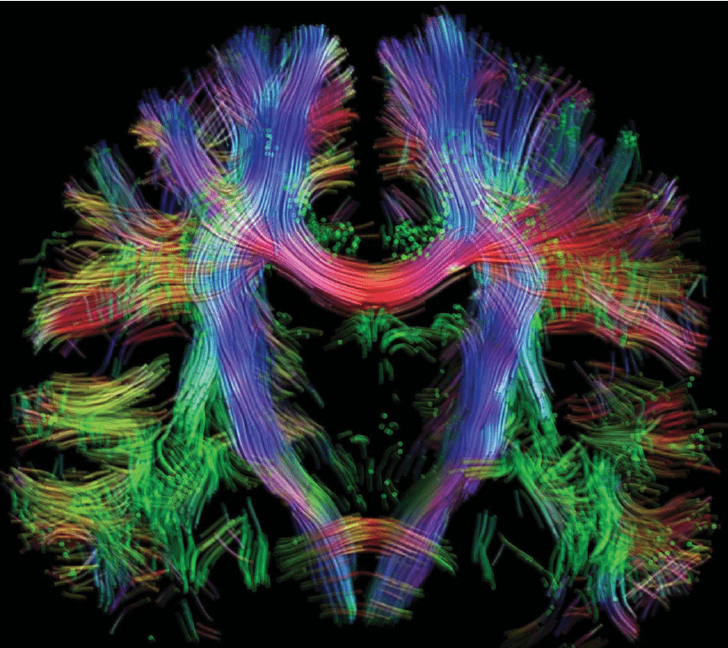

<!-- This is an html comment and this won't appear in the rendered page. You are now editing the "content" area, the core of your description. Everything that you can do in markdown is allowed below. We added a couple of comments to guide your through documenting your progress. -->

# Schizophrenia prediction: use of Neuroimages and Artificial Intelligence Models

Hugo Galván, Agustina Boveda, Pablo Koss,Sebastian Galván

## Summary 

The review discusses using tractography techniques in MRI to capture structural connectivity and evaluating existing connections of the PFC, creating a script to separate data, comparing classification models, and comparing the connectome of healthy subjects with those diagnosed with schizophrenia.

## Project definition

### Background

**Schizophrenia theories**: Theory of Disconnection Syndrome
* The theory of disconnection syndrome is a theory that explains the symptoms of schizophrenia as the result of disruptions in the normal integration of emotion, perception, and thought.

**Previous works and literature**: Use of only one method of analyses, Require additional validation afterwards
* [Schizophrenia prediction using tractography and machine learning](https://www.sciencedirect.com/science/article/pii/S1053811919303837)
* [Schizophrenia prediction using fMRI and machine learning](https://www.sciencedirect.com/science/article/pii/S1053811919303837)

**MRI**: Now it’s only use for differential diagnosis and not for prediction

### Tools

The "Schizophrenia" project will rely on the following technologies:
 * Processing of Tractography data is done with `DSI Studio`
 * Processing of fMRI data is done with `SPM`
* Machine learning anlayses rely on `scikit-learn`.
 * The main summary and results of the project are stored in a [Jupyter Notebook](https://jupyter.org/index.html)
 * Updating and version control relies on github, through commits and pull requests.

### Data

The preprocessed data is publicly available on [UCLA Consortium for Neuropsychiatric Phenomics LA5c Study](https://purl.stanford.edu/mg599hw5271). The data is composed of 2 groups of subjects: 1) 58 patients with schizophrenia and 2) 138 Healthy controls. The data is composed of 2 modalities: 1) fMRI and 2) Tractography. The data is already preprocessed and ready to be used.

### Deliverables
Note that the deliverables changed somewhat over the course of the project, and are more extensive than the original conception.

The [Github repository](https://github.com/brainhack-school2023/hcgalvan_project/blob/master/analysis.ipynb) that contains all of the relevant code for the project, clearly formatted and commented.

* Data, generated from the [UCLA Consortium for Neuropsychiatric Phenomics LA5c Study](https://purl.stanford.edu/mg599hw5271) dataset as described above.
 * Code for the analysis "pipeline" using Python
 * Jupyter notebook for interactive data visualization
 * This README.md file describing the project
 * Examples of visualizations created using the pipeline and notebooks
 * The slides used for the final Brainhack School presentation

## Results

### Progress overview

The project was divided into 3 main parts: 1) Data preparation, 2) Machine learning, and 3) Data visualization. The first part was done using `DSI Studio` and `SPM`. The second part was done using `scikit-learn`. The third part was done using `Jupyter Notebook`.

### Tools I learned during this project

* `DSI Studio` for tractography data processing and visualization
* `SPM` for fMRI data processing and visualization 
* `scikit-learn` for machine learning analyses
* `Jupyter Notebook` for data visualization and presentation

### Results
* The results of the project are summarized in the [Github repository](
  
#### Deliverable 1: report template
* The report template is available in the [Github repository- Metrics](https://github.com/brainhack-school2023/hcgalvan_project/blob/main/scripts/mvp-metrics.ipynb)

#### Deliverable 2: project gallery
* The project gallery is available in the [Github repository- Pipeline](https://github.com/brainhack-school2023/hcgalvan_project/blob/main/src/pca_reduct_end.ipynb)

## Conclusion and acknowledgement

### Conclusion
1. We have managed, among many tasks, to link the worlds of clinical medicine, laboratory neurosciences and supervised learning, looking for the models achieved to support the clinic in a format
a) screening, or with a tolerable bias to false positives that, together with other studies, advance in depth for a final diagnosis
b) as a tool for minimum tolerance to biases, and pathology is taken as the last study and finalizes the clinical diagnosis process.

2. Under these criteria, we are putting together modeling strategies, on operational hypotheses that are on the project's work table and beyond metrics that may be low, highlighting the variances of the important characteristics in the laboratory.
We begin to understand the noise between variances that prevent us from visualizing and obtaining objective metrics. Also where they come from and we are putting together another model that verifies these facts and penalizes when detected, which will help highlight the true attributes that are hidden.

3. We are understand  that they are a tool to support the clinic in the diagnosis, and that they are a tool to advance in the understanding of the disease and its treatment.

## Acknowledgements
Thanks to all of the instructors, teaching assistants, and participants of the Brainhack School 2023! Thanks to the organizers, HUMAI, Hub Buenos Aires, and the Brainhack School 2023 sponsors for making this possible. Thanks to the [UCLA Consortium for Neuropsychiatric Phenomics LA5c Study](https://purl.stanford.edu/mg599hw5271) for making the data publicly available.