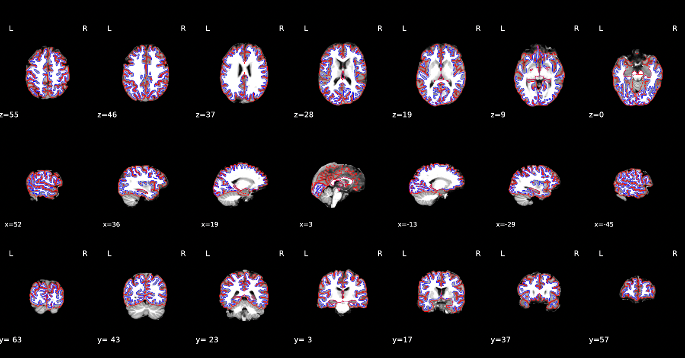
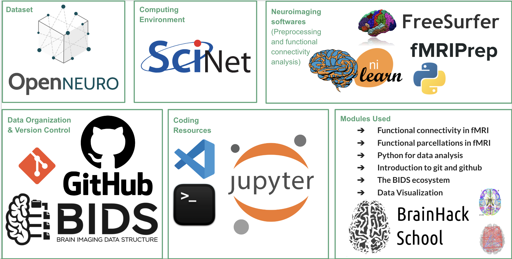
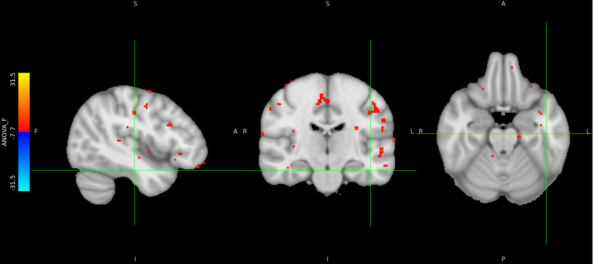
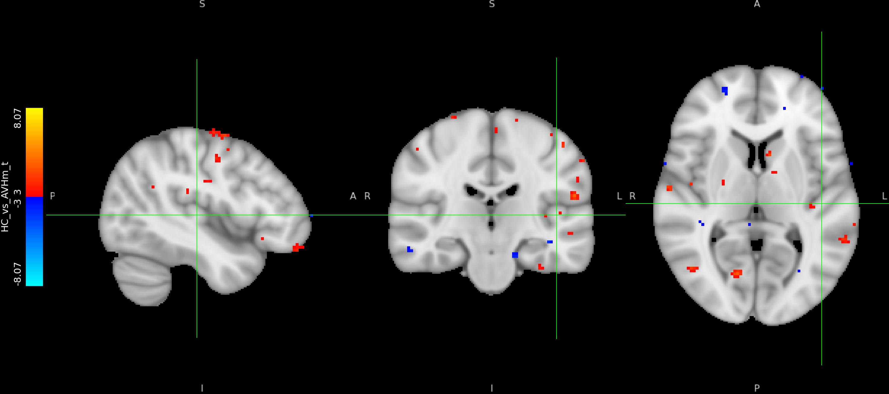
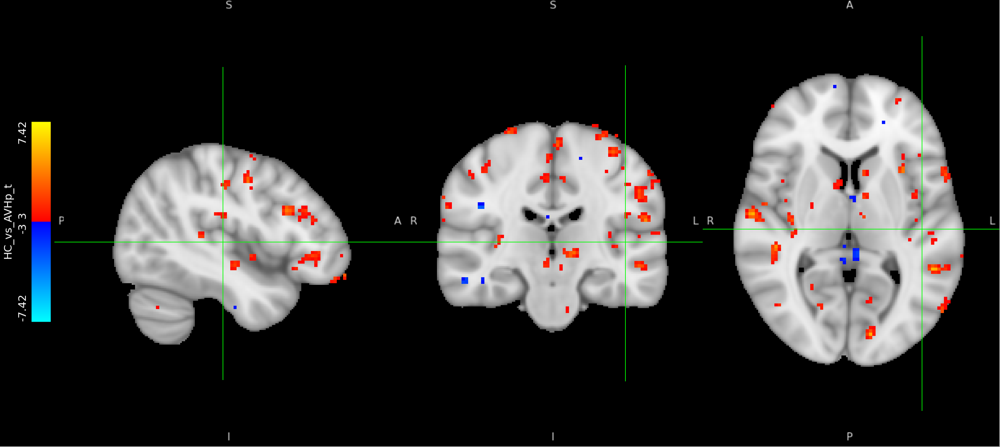
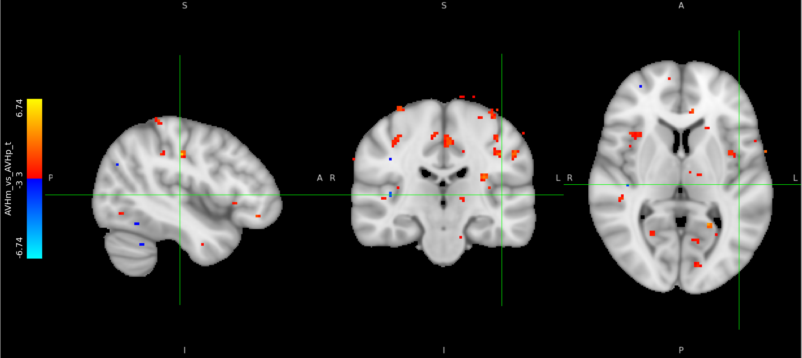

<!-- This is an html comment and this won't appear in the rendered page. You are now editing the "content" area, the core of your description. Everything that you can do in markdown is allowed below. We added a couple of comments to guide your through documenting your progress. -->

## Project Definition: Background, Research Question, Project Objectives

### Background

Schizophrenia is a chronic psychiatric disorder that affects approximately 24 million individuals worldwide and is increasingly regarded as a disorder of brain network dysconnectivity (Friston & Frith, 1995; Alderson-Day et al., 2015). Rather than reflecting dysfunction within a single brain region, symptoms may emerge from altered communication among distributed neural systems.

Auditory verbal hallucinations (AVHs) are among the most common positive symptoms of schizophrenia and affect approximately 60-80% of individuals with schizophrenia. Neuroimaging studies suggest that AVHs involve abnormal interactions between auditory processing regions, language networks, and systems involved in self-monitoring and internally generated speech (Jardri et al., 2011; Alderson-Day et al., 2015). In addition, previous work has consistently implicated the left auditory cortex, particularly regions surrounding Heschl's gyrus, in the pathophysiology of hallucinations (Gavrilescu et al., 2010; Shinn et al., 2013).

This project utilizes OpenNeuro dataset ds004302 from Soler-Vidal et al. (2022), which includes fMRI data acquired during a speech perception task from healthy controls, schizophrenia patients without auditory verbal hallucinations (AVH−), and schizophrenia patients experiencing auditory verbal hallucinations (AVH+).

**Main Question:**
Do healthy controls, AVH− participants, and AVH+ participants differ in the functional connectivity of the auditory cortex during speech perception?

**Research Objectives**
1. Learn neuroimaging preprocessing and quality control workflows using fMRIPrep.
2. Develop skills in seed-based functional connectivity analysis using Nilearn.
3. Apply reproducible neuroimaging workflows to open-source schizophrenia datasets.
4. Examine auditory cortex connectivity patterns associated with hallucination status.
5. Gain experience using high-performance computing resources and collaborative software development tools.
   
## Methodology: Workflow, Tools Used

**Workflow & Procedures**
1. Data Organization: Raw neuroimaging data were obtained from OpenNeuro (ds004302) and organized according to BIDS standards.

2. fMRI Preprocessing: Functional and anatomical MRI data were preprocessed using fMRIPrep. Processing included motion correction, anatomical-functional coregistration, tissue segmentation, normalization to MNI space, and confound extraction. Slice timing correction was omitted because the primary objective was seed-based functional connectivity analysis. Skull stripping was skipped because the raw neuroimaging data already underwent skull stripping.

3. Seed Definition: A seed region corresponding to the left auditory cortex was identified using the Schaefer 2018 functional atlas. The selected parcel was the cortical region nearest to a literature-based left Heschl's gyrus coordinate (MNI: −42, −26, 10).

4. Functional Connectivity: The average BOLD signal from the auditory cortex seed was extracted for each participant. Connectivity between the seed and every voxel in the brain was calculated using Pearson correlation.

5. Fisher-z Transformation: Correlation coefficients were transformed using Fisher's z transformation to improve suitability for statistical analyses.

6. Statistical Analysis Between Groups: Connectivity maps were compared between healthy controls, AVH− participants, and AVH+ participants using two-sample t-tests and one-way ANOVA.

### Tools Used

In summary, the dataset was obtained from OpenNeuro and organized according to the Brain Imaging Data Structure, or BIDS, which provides a standardized framework for managing neuroimaging data. Computationally intensive analyses were performed on SciNet, a high-performance computing cluster.

For preprocessing, we used fMRIPrep and FreeSurfer, while functional connectivity analyses were conducted in Python using Nilearn. Throughout the project, we used VS Code, Jupyter Notebooks, and the command line interface for coding and analysis, while GitHub was used for version control and project organization to support reproducibility and collaboration. 

**Figure 1.** Pre-processed surface reconstruction for subject #1.

**Neuroimaging Software**
1. fMRIPrep (v25.2.4)
2. Nilearn
3. FreeSurfer

**Computing Environment**
1. SciNet Teach Cluster
3. Python/Jupyter Notebooks
4. VSCode/Terminal

**Data Standards and Version Control**
1. OpenNeuro
2. Brain Imaging Data Structure (BIDS)
3. Git and GitHub

**Figure 2.** Tools used for the brainhack project.

## Data

### Data Characteristics

The complete dataset (OpenNeuro, ds004302) contains 71 participants across three groups. Due to time constraints, analyses were initially conducted on a subset of 27 participants consisting of:
* 9 Healthy Controls
* 9 AVH− Participants
* 9 AVH+ Participants

### Deliverables

At the end of this project, we will have:
1. Reproducible GitHub repository
2. README file (this project report)
3. fMRI preprocessing script
4. Seed-based functional connectivity script
5. Group-level analysis script

### Repository Contents

The repository contains:
1. Preprocessing scripts
2. Functional connectivity scripts
3. Group-level statistical analysis code
4. Documentation and workflow descriptions (git log, commits)
5. BrainHack presentation materials
6. Figures and outputs

## Results: Skills Learned, Preliminary Findings

### Overview 

A complete preprocessing and functional connectivity workflow was successfully implemented using fMRIPrep and Nilearn. Preprocessing was conducted on the SciNet Teach cluster using containerized workflows. Seed-to-voxel connectivity maps were generated using the left auditory cortex as the seed region and subsequently analyzed at the group level.

### Skills Learned

**Neuroimaging Analysis**
* BIDS-compliant dataset organization
* fMRIPrep preprocessing workflows
* Quality-control assessment of MRI data
* Seed-based functional connectivity analysis
* Group-level neuroimaging statistics

**Computational Skills**
* Teach cluster usage 
* Containerized neuroimaging workflows using Apptainer
* Git and GitHub version control
* Python-based neuroimaging analyses

### Preliminary Findings

Voxel-wise seed-based functional connectivity analyses were performed using Fisher z-transformed correlation maps from the left Heschl’s gyrus seed. Pairwise group comparisons (HC vs. AVH−, HC vs. AVH+, and AVH− vs. AVH+) were conducted using two-sample t-tests, and a one-way ANOVA was used to assess overall group differences. Statistical significance was evaluated using voxel-wise Benjamini–Hochberg false discovery rate (FDR) correction (q = 0.05).

**Figure 3.** ANOVA conducted to assess group differences (HC, AVH-, AVH+).

A significant difference in functional connectivity was observed between the HC and AVH+ groups, with 832,821 voxels surviving FDR correction. In contrast, no voxels survived FDR correction for the HC vs. AVH− comparison, the AVH− vs. AVH+ comparison, or the omnibus one-way ANOVA. These findings suggest robust alterations in left Heschl’s gyrus connectivity in patients with auditory verbal hallucinations relative to healthy controls, whereas differences involving the AVH− group were not statistically significant after correction for multiple comparisons. 

**Figure 4.** Functional connectivity analysis between HC and AVH-.

**Figure 5.** Functional connectivity analysis between HC and AVH+.

**Figure 6.** Functional connectivity analysis between AVH- and AVH+.

However, because the AVH+ and AVH− groups did not significantly differ after correction, these results should not be interpreted as definitive evidence of hallucination-specific connectivity differences. Instead, they provide preliminary support for further examining whether auditory hallucinations are associated with broader network-level alterations in auditory, language, salience, sensorimotor, and default mode systems. 

### Limitations

Several limitations should be noted. The current analysis used a small subset of the full dataset and focused only on the sentences condition. Although the original goal was to preprocess the full dataset and conduct both seed-to-voxel and ROI-based functional connectivity analyses, this was not feasible within the project timeline. A major challenge was that preprocessing had to be repeated after we determined that the OpenNeuro dataset had already undergone skull stripping, requiring the fMRIPrep workflow to be modified and rerun with skull stripping skipped. As a result, the present findings are based on the corrected preprocessing pipeline for the 27-participant subset and should be treated as exploratory. The large number of significant voxels in the HC vs. AVH+ contrast also requires follow-up to confirm that the effect reflects meaningful connectivity differences rather than masking, preprocessing, or variance-related issues.

## Conclusion: Wrap-Up, Future Directions

### Future Directions

Future BrainHack groups could build on this project by extending the corrected preprocessing and seed-based functional connectivity workflow to the full ds004302 dataset. Because the present project established the core pipeline but was limited by preprocessing delays and time constraints, future work can:

1. Complete corrected preprocessing of the full dataset (n = 71)
2. Perform whole-sample seed-to-voxel and ROI-based connectivity analyses
3. Investigate connectivity within auditory, language, salience, sensorimotor, and default mode networks
4. Examine relationships between connectivity patterns and hallucination status
5. Explore demographic and clinical moderators, including age, sex and medication use.

We thank the BrainHack teaching team, the teaching assistants and professor, for their guidance throughout the program!

## References

Alderson-Day, B., McCarthy-Jones, S., & Fernyhough, C. (2015). Hearing voices in the resting brain: A review of intrinsic functional connectivity research on auditory verbal hallucinations. Neuroscience & Biobehavioral Reviews, 55, 78–87.
   
Friston, K. J., & Frith, C. D. (1995). Schizophrenia: A disconnection syndrome? Clinical Neuroscience, 3(2), 89–97.

Gavrilescu, M., Rossell, S., Stuart, G. W., Shea, T. L., Innes-Brown, H., Henshall, K., McKay, C., Sergejew, A. A., Copolov, D., & Egan, G. F. (2010). Reduced connectivity of the auditory cortex in patients with auditory hallucinations: A resting state functional magnetic resonance imaging study. Psychological Medicine, 40(7), 1149–1158.
     
Jardri, R., Pouchet, A., Pins, D., & Thomas, P. (2011). Cortical activations during auditory verbal hallucinations in schizophrenia: A coordinate-based meta-analysis. American Journal of Psychiatry, 168(1), 73–81.
     
Shinn, A. K., Baker, J. T., Cohen, B. M., & Öngür, D. (2013). Functional connectivity of left Heschl’s gyrus in vulnerability to auditory hallucinations in schizophrenia. Schizophrenia Research, 143(2–3), 260–268.

Soler-Vidal, J., Fuentes-Claramonte, P., Salgado-Pineda, P., Ramiro, N., García-León, M. Á., Torres, M. L., Arévalo, A., Guerrero-Pedraza, A., Munuera, J., Sarró, S., Salvador, R., Hinzen, W., McKenna, P., & Pomarol-Clotet, E. (2022). Brain correlates of speech perception in schizophrenia patients with and without auditory hallucinations. PLOS ONE, 17(12).

Cover image courtesy of the National Cancer Institute.