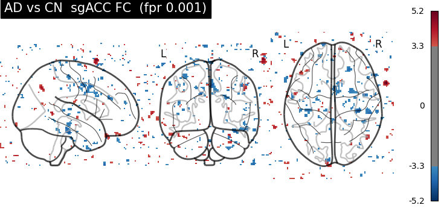
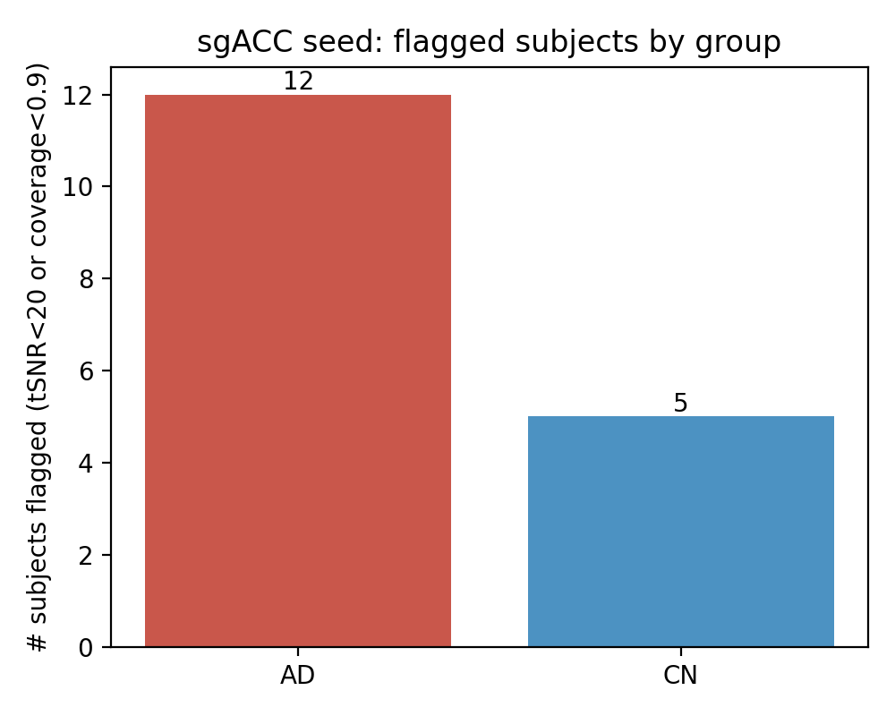
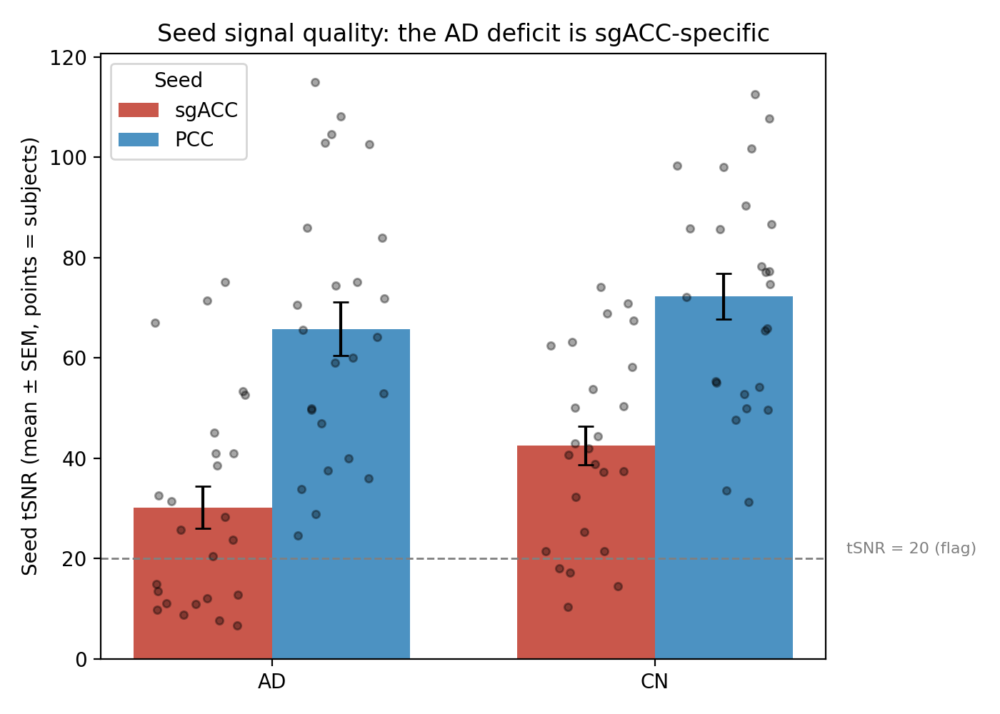

## Project definition
---

### Background

The **subgenual anterior cingulate cortex (sgACC, Brodmann area 25)** is a hub of the default mode network and a well-established target in mood and neurodegenerative research. Its resting-state functional connectivity (FC) has been studied extensively in depression, where it provides the anatomical basis for individualized neuromodulation targets. Far less is known about how sgACC connectivity changes in **Alzheimer's disease (AD)**, even though the default mode network is among the earliest and most consistently affected networks in AD.

We asked a straightforward question: **does resting-state FC of the sgACC differ between AD patients and cognitively normal (CN) older adults?** We used the canonical sgACC seed from [Fox et al. (2012)](https://doi.org/10.1016/j.biopsych.2012.04.028) and a seed-to-voxel connectivity approach in a matched two-group design.

What we found was a clean negative result at the group level, and then a quality-control analysis that explained the negative result and became the actual contribution of the project. The sgACC sits in a region of the ventromedial frontal lobe that is notoriously prone to **susceptibility-induced signal dropout** in echo-planar imaging, and that dropout turned out to be unevenly distributed across our two groups. This page documents both the planned analysis and the QC story that reframes it.

### Tools

The project relied on:

- **Git / GitHub** for code sharing and reproducibility (data never committed — see below).
- **SciNet Teach cluster** (high-performance computing) for all preprocessing and connectivity jobs.
- **`dcm2bids` (3.2.0)** for DICOM → BIDS conversion.
- **fMRIprep (25.2.4)**, run via Apptainer, for preprocessing.
- **Nilearn** for seed-based connectivity and the second-level group model.
- **`nibabel`, `numpy`, `scipy`, `pandas`, `matplotlib`** for the QC analysis and figures.

### Data

Data came from the **Alzheimer's Disease Neuroimaging Initiative (ADNI), phase ADNI3**, accessed through the LONI Image & Data Archive. We used raw (Original) DICOM, requiring per subject one **resting-state fMRI** scan and one **T1-weighted MPRAGE** structural (fMRIprep needs the T1), acquired on the same date.

To keep acquisition consistent we restricted to **single-band rs-fMRI only** (multiband excluded), and excluded ASL/perfusion, DTI, MoCoSeries, and localizers.

The raw ADNI pools are demographically imbalanced (AD skews male, CN skews female), so we built a **deliberately matched subset** rather than a random draw:

- **25 AD + 25 CN**, no subject in both groups.
- **Sex-balanced:** 13 M / 12 F in each group.
- **Age-matched:** AD mean 74.1 (range 55–91), CN mean 74.6 (range 56–95); the age difference is not significant.
- Groups are **AD vs CN only** — no MCI or SCD — for a clean two-group comparison.
- Multi-vendor / multi-site (Siemens, Philips).

**A note on data sharing:** the ADNI Data Use Agreement prohibits redistributing raw data. No imaging data, demographics CSVs, or subject-level TSVs are committed to the repository; the repo is **code-only**, and `.gitignore` excludes `data/`, `results/`, and all imaging files. One team member held the single point of cluster-side data access.

**Limitation worth stating up front:** ADNI is demographically narrow (roughly 88% white, highly educated), so any finding has limited generalizability.

### Project deliverables

- A reproducible, code-only pipeline: DICOM → BIDS → fMRIprep → seed-based FC → group comparison.
- A seed coverage / tSNR quality-control analysis and a positive-control comparison.
- Figures documenting the QC confound.
- This report.

## Results
---

### Pipeline overview

The full pipeline was built and run end-to-end on all 50 subjects:

1. **DICOM → BIDS** with `dcm2bids` 3.2.0. One subject with blank series descriptions used a fallback config matching `MRAcquisitionType`.
2. **fMRIprep 25.2.4** on SciNet, output to `MNI152NLin6Asym` (2 mm), with `--fs-no-reconall` (volumetric seed-to-voxel analysis needs no surfaces, which dramatically cuts runtime). 41 subjects ran with fieldmap-less distortion correction (`--use-syn-sdc`); 9 subjects were missing `PhaseEncodingDirection` in their BOLD sidecars and were processed with `--ignore fieldmaps slicetiming`.
3. **Seed-based FC in Nilearn.** sgACC seed at MNI **(6, 16, −10)**, 5 mm sphere (Fox et al. 2012). Denoising via `load_confounds(strategy=("motion","wm_csf"))`; bandpass 0.01–0.1 Hz; per-voxel Pearson *r* → Fisher *z*. Both maskers used `standardize="zscore_sample"` so the dot product yields a correlation rather than a covariance.
4. **Second-level group model** (Nilearn `SecondLevelModel`): AD vs CN, with covariates age (mean-centered), sex, and mean framewise displacement.

### Group result: a null at FDR q < 0.05

**No voxels survived FDR correction (q < 0.05)** in the AD-vs-CN sgACC connectivity contrast (max |z| ≈ 5.2). An exploratory uncorrected map (p < 0.001) showed only scattered, spatially incoherent voxels consistent with noise.

Taken alone, this would be an uninformative negative result. The next step is what made it interpretable.

##### Figure 1. Uncorrected (p < 0.001) AD-vs-CN sgACC FC contrast — scattered, spatially incoherent voxels

### Key finding: the seed does not carry equal signal in both groups

A per-subject **seed coverage and temporal signal-to-noise (tSNR)** QC at the sgACC revealed a systematic group difference *in the data quality of the seed itself*:

- **Mean seed tSNR:** AD ≈ 30 vs CN ≈ 43.
- **Mean seed coverage:** AD ≈ 0.91 vs CN ≈ 0.98.
- **17 of 50 subjects flagged** (tSNR < 20 or coverage < 0.9): **12 AD, 5 CN.**
- The flagged subjects were **driven largely by one scanner site (site 168)**, which contributed disproportionately to the AD group (~7 AD vs ~1 CN). Scanner site and diagnostic group are therefore **partly the same variable** — a site × group confound.
- The effect was **robust to seed radius** (5 mm ≈ 6 mm), so it reflects a real seed-location/site effect, not a parameter artifact.

The implication is direct: an AD-vs-CN FC difference at the sgACC could not be cleanly attributed to disease, because the seed region carries worse signal in AD subjects to begin with. **This QC result is the project's headline.**

##### Figure 2. Subjects flagged for low seed tSNR / coverage, by group (12 AD, 5 CN)

### Positive control: the deficit is sgACC-specific, not global

To test whether AD subjects simply had globally poor data, we re-ran the identical QC at a **posterior cingulate cortex (PCC)** seed — a reliable, low-dropout default-mode node — at MNI **(0, −52, 26)**, 5 mm.

At the PCC, both groups looked healthy and overlapping: **AD ≈ 66 / CN ≈ 72 mean tSNR, full coverage, zero flagged subjects.** The same AD scans that cratered near tSNR ≈ 10 at the sgACC sat comfortably at 50–80 at the PCC. There is a small (~9%) overall AD < CN tSNR gap at the PCC, but the sgACC gap is roughly **three times** that and is the only location where coverage drops and subjects get flagged.

**Conclusion: the AD signal deficit is sgACC-specific** — a susceptibility-dropout effect localized to the ventromedial seed region — **not globally bad data.** This is the clinching control.

##### Figure 3. sgACC vs PCC seed tSNR by group (per-subject points + group mean ± SEM; flag line at tSNR 20)

### Sensitivity analyses: the null is robust

We confirmed the negative result is not an artifact of the confounding factors:

- **Excluding site 168 entirely (n = 42):** groups remained matched (sex p = 1.0, age p = 0.62); still **no voxels survived FDR**.
- **Iterative 2-SD high-motion removal** on mean FD (applied twice), which also resolves the highest-motion subject: still **null**.

So we are not hiding a real effect behind site or motion — the null holds, and the QC confound is the honest explanation for it.

## Conclusion and what we learned
---

The planned analysis produced a null, but the project's real result is a **methodological one**: a seed-based FC comparison is only as trustworthy as the signal in the seed, and at the sgACC that signal was systematically worse in the AD group, partly because of an uneven scanner-site distribution. A PCC positive control localized the deficit to the seed, and sensitivity analyses showed the null was robust. The takeaway — **a confounded null, honestly diagnosed** — is more useful than a group difference we couldn't have interpreted.

Concrete lessons from building this:

- **The sgACC is a high-susceptibility region.** Any future sgACC fMRI work should run a coverage/tSNR check on the seed *before* interpreting connectivity, and should check for fieldmaps at conversion so distortion correction is available.
- **QC is a result, not a chore.** The positive-control design (re-running the same QC at a low-dropout seed) is what turned "we found nothing" into "here is why, and here is the evidence."
- **Reproducibility within a Data Use Agreement is workable** — a code-only repo with strict `.gitignore` and a single cluster-side data access point kept us compliant without blocking collaboration.
- **Pipeline-level lessons:** `--fs-no-reconall` makes volumetric fMRIprep tractable on a teaching cluster; offline TemplateFlow must be pre-staged because compute nodes have no internet; `standardize="zscore_sample"` is required for the Fisher-z step to be valid.

## Acknowledgement
---

Thank you to the BrainHack School 2026 (Toronto) organizers, instructors, and TAs, and to the SciNet team for cluster support. Data used in this project were obtained from the Alzheimer's Disease Neuroimaging Initiative (ADNI) database (adni.loni.usc.edu).

## References
---

Fox MD, Buckner RL, White MP, Greicius MD, Pascual-Leone A. Efficacy of transcranial magnetic stimulation targets for depression is related to intrinsic functional connectivity with the subgenual cingulate. *Biological Psychiatry*. 2012;72(7):595–603. doi:10.1016/j.biopsych.2012.04.028

Esteban O, et al. fMRIPrep: a robust preprocessing pipeline for functional MRI. *Nature Methods*. 2019;16:111–116.

Abraham A, et al. Machine learning for neuroimaging with scikit-learn (Nilearn). *Frontiers in Neuroinformatics*. 2014;8:14.
