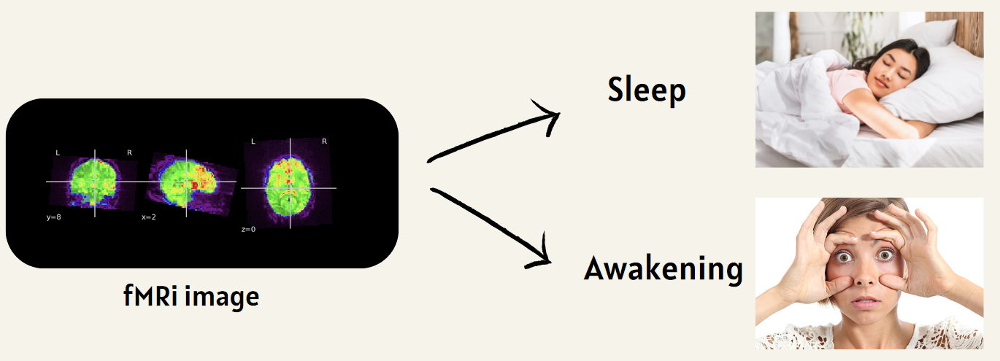
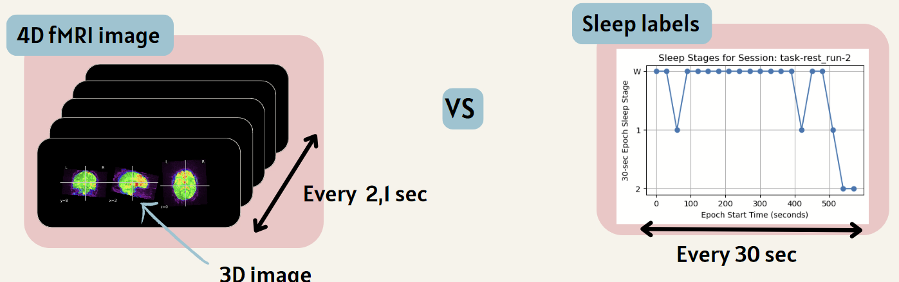
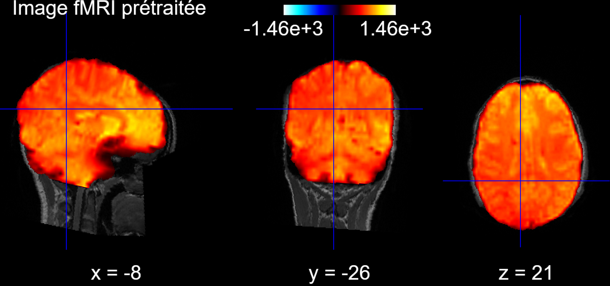
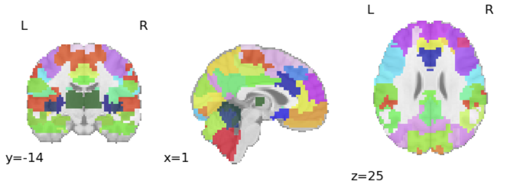
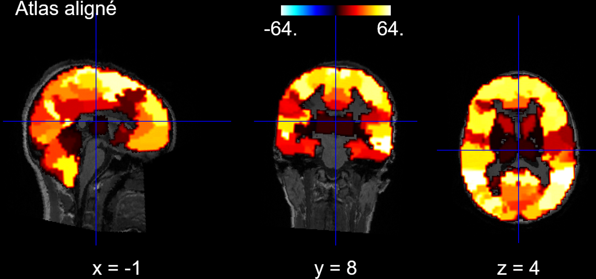
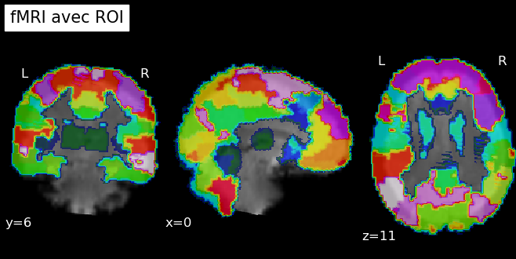
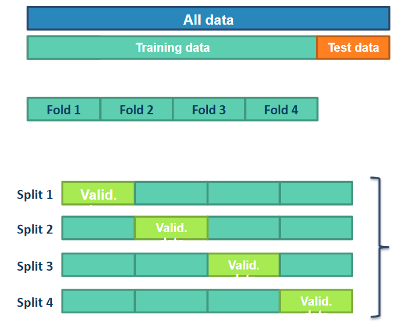
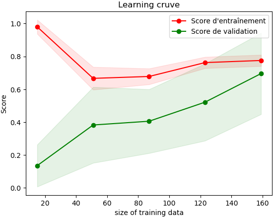
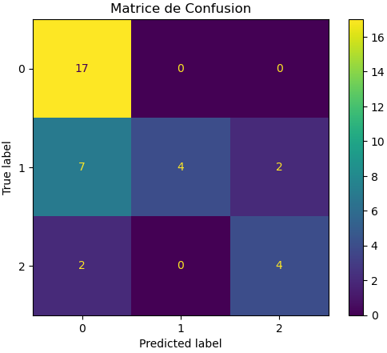

## Project Summary

### Introduction

This project explores the use of fMRI data to predict sleep states via machine learning algorithms. By enhancing our understanding of sleep patterns and disorders, this research offers valuable insights into brain activity across various sleep stages. It holds the potential to advance diagnostic methods and develop personalized treatments for sleep disorders. The primary objective is to determine a participant's sleep or wake state using resting-state fMRI data.

### Main Objectives

- Develop a comprehensive neuroimaging workflow, encompassing raw data preprocessing, feature extraction, model training, and results visualization.
- Prioritize reproducibility, ensuring every element of the project can be easily replicated, including detailed documentation and open-source code availability.
- Assess the efficacy of machine learning algorithms in predicting sleep states using fMRI connectivity data.

### Personal Objectives

- Acquire a thorough understanding of fMRI and neuroimaging database structures, along with best practices.
- Cultivate skills in preprocessing and analyzing fMRI data.
- Apply machine learning techniques to neuroscience research.

### Tools

- Git and GitHub for Version Control
- jupyter notebook for result presentation
- BIDS for dataset standardization and exploitation
- sklearn for Machine learning
- nipype, FSL for Data Preprocessing
- Python Packages: `numpy`, ``scikit-learn``, ``nibabel``, ``nilearn``, ``matplotlib``

### Deliverables
- [GitHub repository](https://github.com/brainhack-school2024/duchadeau_project) : project code
- Markdown file (this file): project description & installation instructions
- **Main.ipynb** : An executable Jupyter notebook with step-by-step instructions for data preprocessing and machine learning
- **Draft_Exploration_datase.ipynb** and **Draft_preprocessinf.ipynb** :  Two draft used to test ideas. Not supposed to be explored but can be helpfull.
- **requirement.txt** : See the installation module 
- **Brainhack-school_final_presentation** : My final presentation of the project

### Dataset Description

The dataset utilized for this analysis includes simultaneous EEG and fMRI recordings from 33 healthy participants, collected at Penn State University with informed consent. It comprises anatomical sessions for structural imaging, two 10-minute resting-state sessions, and multiple 15-minute sleep sessions. The first resting session occurred before a visuomotor adaptation task (Albouy et al., Journal of Sleep Research, 2013), and the second followed the task. Sleep stage data for these subjects are organized in the 'sourcedata' folder, with TSV files annotating sleep stages for each 30-second interval, categorized as "w" (wake), "1" (NREM1), "2" (NREM2), "3" (NREM3), "uncertain" (uncertain periods), and "unscorable" (artifact-ridden periods). MRI data were obtained using a Siemens Prisma Fit 3 Tesla scanner with a 20-channel receive coil, featuring MPRAGE sequence for anatomical images (TR: 2300 ms, TE: 2.28 ms, 1 mm isotropic spatial resolution) and EPI sequence for BOLD fMRI data (TR: 2100 ms, TE: 25 ms, 4 mm slice thickness). Although EEG data were recorded, they are not utilized in this analysis. The dataset also includes a CSV file with sleep stages used to train the algorithm.

For more information or questions about this dataset, please refer to the [open-neuro dataset page](https://openneuro.org/datasets/ds003768/versions/1.0.11)

## Results

To recap, the objective of this project is to process raw fMRI data, make it exploitable, and train a machine learning algorithm to identify whether a patient is asleep or awake based on their fMRI images.



To achieve this, we divided our work into three steps:
1. Select the appropriate data from the dataset.
2. Preprocess the fMRI images to make them usable.
3. Apply a machine learning algorithm to perform the recognition.

Let's begin with the first section:

### 1. Select Data
The goal of this section is to select the correct data since the temporal resolution of the labels does not match the temporal resolution of the fMRI images.



To do this, we select only the data that exactly corresponds to the labels. All these steps can be found in the `Main.ipynb` file.

### 2. Preprocessing
Once the data is selected, it must be preprocessed to make it usable, providing our algorithm with only the useful information to avoid, among other things, overfitting (we don't want our algorithm to learn to recognize patients based on skull shapes, for example).

#### 2.1 Brain Preprocessing
First, we extract the brain from the fMRI data to keep only the exploitable part:


Second, we align the brain to the corresponding T1 scan of the patient to be able to apply an atlas later:



#### 2.2 Atlas Definition
Next, we choose an atlas that allows us to define regions of interest (ROI) to focus our efforts. The chosen atlas defines 64 regions of interest:



To apply our atlas, we also need to align it to the T1 scan of each patient:



#### 2.3 Atlas Application
Finally, since our brain is aligned with the T1 scan and the atlas is also aligned, both are aligned, and we can apply a masker to our data to define the regions of interest on our brains:



### 3. Machine Learning Algorithm
Finally, we can apply our machine learning algorithm to our data. The chosen algorithm is an [SVC algorithm](http://un-est-tout-et-tout-est-un.blogspot.com/2018/12/ia-classification-svc-avec-scikit-learn.html), and we use the cross-validation technique to test our algorithm:



Ultimately, we achieve an average of **70% accuracy**, and we can create a validation curve and a confusion matrix to see where the algorithm struggles:




We can see that the algorithm performs well in detecting wakefulness but struggles to detect shallow sleep cases.

*Note:* Due to hardware limitations, the algorithm was trained on a very limited volume of data, but we can imagine it will perform even better with a larger dataset.

See `Brainhack-school Final Presentation.pdf` for more details on potential improvements.


## Setup Instructions

### Step 1: Create a Virtual Environment

Create a virtual environment to install the necessary libraries in an isolated environment:

```
python -m venv fmri_env
```

### Step 2: Activate the Virtual Environment

Activate the virtual environment:

- **Windows:**
  ```bash
  .\fmri_env\Scripts\activate
  ```

- **MacOS/Linux:**
  ```bash
  source fmri_env/bin/activate
  ```
### Step 3: Download FSL
Download flsinstaller.py on [this](https://fsl.fmrib.ox.ac.uk/fsl/fslwiki/FslInstallation) site

### Step 4: Install FSL
Install FSL by tapping:
```
pip install flsinstaller.py
```

### Step 4: Install Required Libraries
Run the following command to install the libraries:
```
pip install -r requirements.txt
```
**Well done it's finish**. The last step is to dowload the dataset used on [openneuro](https://openneuro.org/datasets/ds003768/versions/1.0.11)
  

## Conclusion and acknowledgement
Thanks to the BHS team for making this project possible with their very accessible and comprehensive courses. Special thanks to the Polytechnique Montreal team for the excellent moments spent together.

## References 
- https://nipype.readthedocs.io/en/latest/
- https://nilearn.github.io/stable/index.html
- https://mniopenresearch.org/articles/1-3
- https://scikit-learn.org/stable/modules/generated/sklearn.decomposition.PCA.html
- http://un-est-tout-et-tout-est-un.blogspot.com/2018/12/ia-classification-svc-avec-scikit-learn.html
- https://github.com/brainhack-school2024/duchadeau_project


