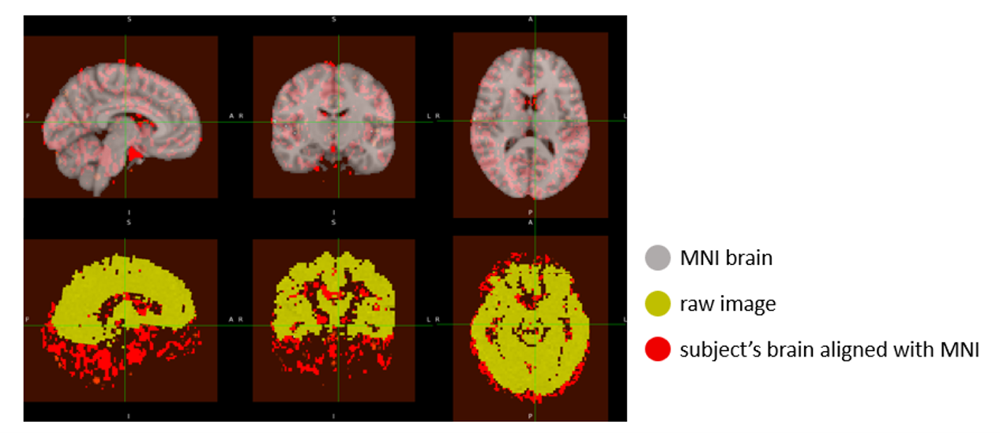
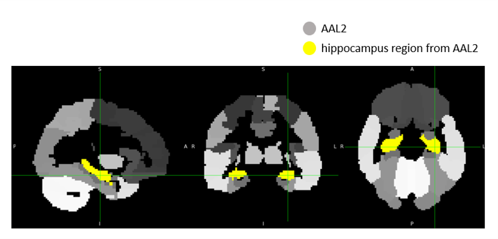
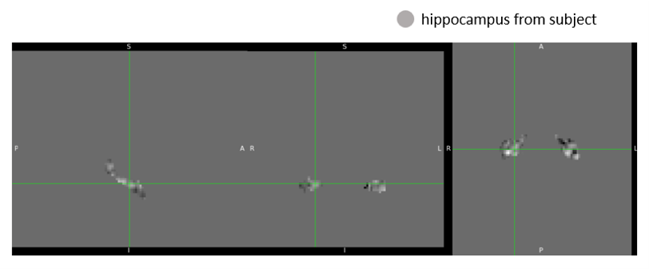

<!-- This is an html comment and this won't appear in the rendered page. You are now editing the "content" area, the core of your description. Everything that you can do in markdown is allowed below. We added a couple of comments to guide your through documenting your progress. -->

## Project definition

### Background

Spatial navigation is a complex cognitive function requiring the integration of diverse sensory inputs to compute goal locations and update self-position during movement. These inputs can be broadly categorized into allocentric and egocentric. Effective navigation depends on the dynamic interaction between these two spatial strategies.

To further investigate how the brain transforms between allocentric and egocentric representations, we developed a virtual environment in which participants navigate from a first-person perspective or learn routes from a top-down map. By manipulating the learning and retrieval modalities (e.g., first-person learning followed by top-down retrieval, and vice versa), we aim to examine the neural mechanisms underlying the transformation between spatial reference frames and the role of non-primary sensory information in navigation.

To address the aims, I’ll observe the connectivity between brain regions, but the virtual map still need a pilot test before recruiting participants. So for my proposal pitch in brain hack school is to practice using NiBabel to extract functional signals from specific brain regions based on EPI data. And I choose hippocampus cause it’s a region can integrate the spatial information to form a cognitive map in our brain.

### Tools

The project will rely on the following technologies:
 * Python, The main programming language for scripting and data analysis.
 * Nibabel, For loading and manipulating neuroimaging data in NIfTI format.
 * Nilearn, For statistical analysis and visualization of functional MRI data.
 * AAL2 Atlas, Used for anatomical parcellation and identifying brain regions of interest.
 * MNI152 Standard Brain Template, Used as the reference space for normalization and visualization.

### Data

The fMRI dataset used in this project comes from a previous spatial navigation experiment conducted in our lab. The data analyzed here corresponds to one subject and includes task-based functional images and corresponding anatomical scans. All data were preprocessed and organized in BIDS format prior to analysis. A manually labeled hippocampal mask was also used to extract region-specific signals.

### Deliverables

At the end of this project, we will have:
 - **Code**: Python scripts and Jupyter notebooks used for loading, processing, and analyzing the fMRI data.
 - **Figures**: Output images illustrating key results, such as brain activation maps and region-specific signal extractions.
 - **Slides**: A summary presentation describing the project background, methods, results, and conclusions, prepared for the final showcase.

## Results

### Progress overview

This project began with selecting and preparing a task-based fMRI dataset from a previous spatial navigation experiment conducted in our lab. The data were converted to BIDS format and preprocessed to ensure compatibility with analysis tools.

Using Python-based neuroimaging libraries such as Nibabel and Nilearn, I extracted time-series signals from the hippocampus using a predefined mask. Additionally, I aligned the subject's brain image to MNI space for standardized analysis and applied the AAL2 atlas for anatomical reference.

### Tools I learned during this project

 - **Nibabel**: I learned how to load, manipulate, and save NIfTI images using Nibabel, which helped me extract fMRI signals from specific brain regions such as the hippocampus.
 - **Nilearn**: I used Nilearn's `resample_to_img` function to match spatial resolution between brain images and anatomical masks, ensuring accurate region-of-interest extraction.
 - **ANTs (Advanced Normalization Tools)**: I applied nonlinear image registration using `ants.registration` to align subject-specific images to the MNI standard brain. This taught me how to implement spatial normalization in a reproducible way.
 - **Python scripting**: Through scripting with loops and conditionals, I automated the processing of multiple runs and trials across different image types (e.g., t-values and betas), which helped streamline my analysis workflow.

### Results

#### Image registration to MNI space

All beta images from the spatial navigation task (spanning 8 runs and 7 trials) were registered to the MNI152 standard brain using the ANTs library. The `SyN` nonlinear transformation ensured that each subject-specific image was accurately aligned to a common anatomical space.

Each output was visually inspected to verify successful alignment, and the registered images were saved for downstream analysis. These MNI-aligned images enable consistent anatomical localization across trials and facilitate integration with standard atlases like AAL2.

#### Hippocampus region extraction

Following registration, a binary hippocampus mask was resampled to each aligned beta image using nearest-neighbor interpolation (`nilearn.image.resample_to_img`). The resampled mask ensured voxel-level correspondence between the mask and the functional images.

We then extracted signals specific to the hippocampus by multiplying each image with the resampled mask, effectively zeroing out all non-hippocampal voxels. The resulting hippocampus-only beta images were saved for further statistical analysis or visualization.

An example of the hippocampus mask from AAL2 and hippocampus-masked output are shown below:

