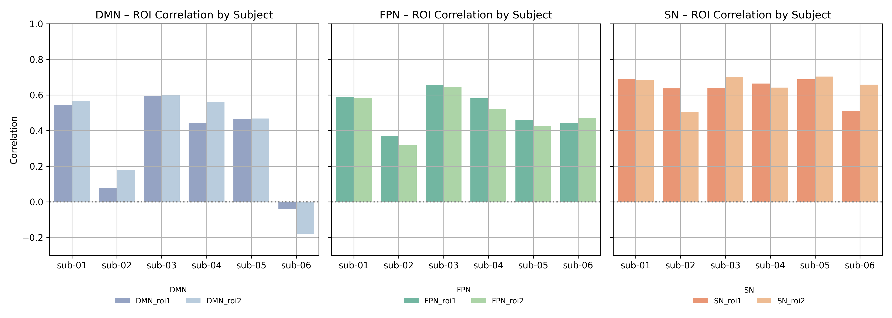

<!-- This is an html comment and this won't appear in the rendered page. You are now editing the "content" area, the core of your description. Everything that you can do in markdown is allowed below. We added a couple of comments to guide your through documenting your progress. -->

## Project definition

### Background

This project was conducted as part of Brainhack School 2025, a program that encourages students to engage in open neuroscience through hands-on experience with real-world neuroimaging datasets. Motivated by an interest in how language functions are represented within the brain’s intrinsic functional architecture, the present project aimed to investigate the resting-state connectivity of language-related brain regions.

The analysis was based on the SMN4Lang dataset, which includes both task-based and resting-state fMRI scans. Language-related regions of interest (ROIs) were first identified through activation patterns during a language comprehension task. Functional connectivity was then assessed between these ROIs and three canonical resting-state networks: the Default Mode Network (DMN), Frontoparietal Network (FPN), and Salience Network (SN). Additionally, the influence of demographic and behavioral variables—such as age and language comprehension performance—on connectivity strength was explored.

Despite numerous technical challenges, including repeated system crashes, the entire analysis pipeline was successfully implemented from scratch. This project marks a significant step toward developing practical skills in functional connectivity analysis and advancing understanding of how language-related regions interact with large-scale neural networks at rest.

### Tools

The "WeiChen_2025BHS_project" project will rely on the following technologies:
* Nilearn: For extracting time series from fMRI data, applying ROI and RSN masks, and computing functional connectivity.  
* NumPy & Pandas: For numerical operations, data wrangling, and managing correlation matrices.  
* Matplotlib & Seaborn: For visualizing functional connectivity patterns and group comparisons.  
* Pingouin & SciPy: For conducting statistical analyses, including Pearson correlations and repeated-measures ANOVAs.  
* Jupyter Notebook: To develop, test, and document the analysis pipeline in a transparent and reproducible manner.  
* Git & GitHub: For version control, collaboration, and sharing the project with the Brainhack community.

### Data

This project uses the SMN4Lang dataset(https://openneuro.org/datasets/ds004078), which includes both task-based and resting-state fMRI data. During the task-based sessions, participants listened to spoken Mandarin narratives while their brain responses were recorded using fMRI. The resting-state scans were collected in the absence of external stimuli to examine the brain's intrinsic functional organization.

The dataset provides preprocessed fMRI images along with corresponding behavioral and demographic data, enabling researchers to investigate the interactions between language-related brain regions and large-scale resting-state networks, and to explore individual differences in language comprehension performance.

For this project, only six participants (sub-01 to sub-06) were selected for analysis, due to computational resource limitations and feasibility considerations.

### Deliverables

At the end of this project, the following deliverables were completed:

* ROI masks and resampled RSN masks used for functional connectivity analysis.
* Z-scored time series extracted from both task-defined ROIs and three resting-state networks (DMN, FPN, SN).
* A correlation matrix quantifying ROI–RSN functional connectivity for each participant.
* Repeated-measures ANOVA results examining the effects of ROI and RSN on connectivity strength.
* Exploration of behavioral and demographic influences on ROI–RSN functional connectivity.

## Results

### Progress overview

This project was developed during Brainhack School 2025, a program that encourages students to explore open neuroscience through hands-on experience. It marked my first step into the field of resting-state fMRI and functional connectivity analysis, and every stage—from preprocessing to final results—was a completely new learning experience.

Through continuous trial and error, I learned how to extract time series, apply ROI and RSN masks, and compute correlation coefficients, gradually gaining an understanding of how to analyze and validate data starting from raw inputs. The process was full of challenges—especially when my computer crashed repeatedly—but completing the full analysis pipeline and seeing meaningful results brought me great satisfaction. I hope this experience will serve as a foundation for my continued exploration into brain data analysis.

### Tools I learned during this project

* **DataLad**: For downloading, managing, and version-controlling open datasets, enabling reproducible data access.
* **Jupyter Notebook**: For writing, executing, and documenting analysis code in an interactive and transparent manner.
* **Nilearn**: For extracting time series from fMRI data and computing functional connectivity between ROIs and resting-state networks.
* **Matplotlib / Seaborn**: For visualizing correlation matrices, group comparisons, and connectivity patterns.
* **Pingouin**: For conducting statistical tests, including Pearson correlations and repeated-measures ANOVAs.
* **NumPy / Pandas**: For data manipulation, matrix operations, and organizing tabular data.
* **GitHub & Markdown**: For version control, documentation, and transparent sharing of project progress and results.

### Results

#### Deliverable 1: Definition of Task-Based ROIs and Resampled RSN Masks

To define language-related regions of interest (ROIs), I first conducted subject-level analysis of the task-based fMRI data, focusing on the contrast between story and baseline. This allowed me to identify language-related activations for each participant. I then performed a group-level analysis to extract brain regions that were consistently activated across subjects, and used these regions to construct the final language-based ROI masks.

For the resting-state network (RSN) masks, I used the Yeo 7-network atlas as a reference. Since the RSN masks and the ROI/resting-state data had different affine matrices, I resampled the RSN masks to ensure proper alignment before extracting time series.

**ROI 1**

**ROI 2**

#### Deliverable 2: Time Series Extraction from ROIs and RSNs

I concatenated the four resting-state runs into a single 4D image file for each participant. Then, I extracted time series from the combined resting-state fMRI data using both the task-defined ROI masks and the resampled RSN masks. The extracted time series were z-scored and saved separately for each participant and each mask type. These time series served as the basis for subsequent functional connectivity analysis.

**Time Series Extracted from ROI**

**Time Series Extracted from RSN**

During the process, I encountered a data quality issue with sub-05. By visualizing the time series from each run individually, I identified that run 1 showed abnormal signal patterns and exhibited abnormally low standard deviation. As a result, run 1 was excluded from the concatenation and omitted from all downstream analyses for sub-05.

**sub-05 Reconcatenated Time Series (Excluding Run 1)**

#### Deliverable 3: ROI–RSN Functional Connectivity Analysis

Based on the time series extracted in the previous step, I computed Pearson correlation coefficients between each ROI and the three resting-state networks (DMN, FPN, and SN) for every participant. The results were organized into individual functional connectivity matrices. I then visualized these matrices to examine the distribution of connectivity strength across networks, the coupling patterns between specific ROIs and RSNs, and the variability across participants.

**ROI–RSN functional connectivity correlation**

#### Deliverable 4: Effects of ROI × RSN on Connectivity Strength

To investigate differences in functional connectivity strength among the three RSNs within each ROI, I first performed a Friedman test, a non-parametric alternative to repeated-measures ANOVA. This was followed by pairwise Wilcoxon signed-rank tests as post-hoc comparisons.

* For ROI 1, the correlation with the SN was significantly higher than with the DMN (p = .031).
* For ROI 2, the correlation with SN was significantly higher than with both DMN and FPN (p = .031 for both comparisons).
    * No significant difference was found between DMN and FPN within ROI 2 (p = .313).

In addition, I compared the connectivity strength between ROI 1 and ROI 2 within each RSN. The results showed no significant difference between the two ROIs in any of the networks (all p > .05), suggesting that the two ROIs exhibit similar connectivity profiles to each RSN.

#### Deliverable 5: Influence of Behavioral and Demographic Factors on ROI–RSN Connectivity

To further explore individual variability in ROI–RSN functional connectivity, I generated participant-wise bar plots displaying the correlation values between each ROI and RSN. Upon inspecting the DMN–ROI connectivity, I noticed that sub-02 and sub-06 showed distinct patterns compared to the other participants.

To investigate this further, I examined their demographic and behavioral profiles, focusing specifically on quiz performance after listening to the stories. I then used Spearman correlation to assess the relationships between age, quiz accuracy, and ROI–RSN connectivity strength.

However, the results revealed no significant correlations between these variables and connectivity measures. Based on this, no clear explanation could be found for the observed individual differences. It is possible that additional data—such as cognitive or neuropsychological assessments—may be required to better understand the sources of variability in ROI–RSN connectivity.

## Conclusion and acknowledgement

### Conclusion
This project represents my first hands-on experience with resting-state fMRI analysis, from constructing task-defined ROIs to computing functional connectivity with large-scale brain networks. By combining task-based and resting-state data from the SMN4Lang dataset, I was able to identify language-related brain regions and examine how they interact with the DMN, FPN, and SN during rest.

Although the connectivity patterns did not show significant associations with behavioral or demographic factors, the results provided a valuable starting point for understanding individual differences in language network integration. The entire workflow—from time series extraction to statistical testing—helped solidify my understanding of neuroimaging pipelines and taught me to approach brain data with both caution and curiosity.

### Acknowledgement

In the nights leading up to my final project presentation, I found myself stuck in endless cycles of trial and error, painfully wondering why I had chosen this course at the beginning of the semester. But looking back now, I realize how much I’ve truly gained from this journey.

I am deeply grateful for the Brainhack School modules, which laid the foundation for everything that followed. As someone with no programming background, I found the step-by-step guidance—starting from bash and GitHub setup, through DataLad and OpenNeuro, and eventually into more advanced analysis—indispensable. The structured progression allowed me to gradually build a coherent understanding of brain data analysis.

I also want to thank the BHS instructors and TAs for creating such an open and supportive learning environment. Their encouragement and flexibility made it possible for us to freely explore topics that genuinely interested us.

Lastly, I want to express my heartfelt thanks to my amazing partner, Chi Wang. We went through countless hours of debugging together, learned to code from scratch side by side, and took our first steps into the world of brain data hand in hand. This journey would have been much more difficult—and far less meaningful—without you.