<!-- This is an html comment and this won't appear in the rendered page. You are now editing the "content" area, the core of your description. Everything that you can do in markdown is allowed below. We added a couple of comments to guide your through documenting your progress. -->


# Tulpas: invisible friends in the brain

TLDR; check out my [to-do list](#My-to-do-list).
<div style="text-align: center;">
   
   
   
</div>

## Background
Tulpamancy is an intriguing psychological and sociocultural phenomenon that presents novel opportunities for neuroimaging research. Derived from Tibetan Buddhist practices, the term "Tulpa" refers to a self-induced, autonomous mental companion created through focused thought and mental conditioning. Individuals who engage in this practice, known as Tulpamancers, report a range of experiences that suggest Tulpas operate independently of the host's conscious control, often possessing their distinct personality, preferences, and perceptual experiences.

Tulpas are not viewed as hallucinations but rather as fully-fledged conscious entities sharing the same neurological space as the host. The creation and interaction with Tulpas require intense concentration and visualization, often leading to the creation of a mentally constructed realm, called a "wonderland," where Tulpamancers and their Tulpas can interact.

Tulpamancy provides a unique framework to explore the capacities of the human mind in creating and perceiving conscious entities. This has substantial implications for our understanding of consciousness, agency, and the malleability of perception. Moreover, it brings forward questions about the neurological underpinnings of these phenomena. How does the brain of a Tulpamancer accommodate multiple conscious entities? Can we observe a distinct neurophysiological pattern associated with the presence of a Tulpa

Through neuroimaging, we aim to investigate these questions, seeking to shed light on the intriguing practice of Tulpamancy and its implications for our understanding of the human mind and consciousness.

To get a better understanding of Tulpamancy you can check the following [video](https://www.youtube.com/watch?v=f3nf6NOPyr8). The video summarises the most important tipps for creating tulpas. These tipps are sourced from the reddit thread [`r/tulpas`](https://www.reddit.com/r/Tulpas/).

<iframe width="560" height="315" src="https://www.youtube.com/watch?v=f3nf6NOPyr8" frameborder="0" allow="accelerometer; autoplay; encrypted-media; gyroscope; picture-in-picture" allowfullscreen></iframe>

## Data

The data used for this project was collected by Dr. Michael Lifshitz (McGill) from 2020 to 2022 at Stanford University, California, USA. The dataset comprises fMRI scans of 22 expert Tulpamancers. The data was aquired during a sentence completion task originally designed by [Walsh et al. (2015)](https://www.sciencedirect.com/science/article/pii/S0010945214003037?casa_token=rzUA8Ep2LcEAAAAA:W-24nUu1MMLfuAMWAIhnP9p_pxmfo1Me0QBdhFrxqeEJ29sWT7pi-7CtrsWeVCBt47AvVjDxowVl). The tasks consists of 10 runs. During each run, participants are given a beginning of a sentnece such as "in summer...". Participants then have 9 seconds to complete this sentence in their mind (preparation) and another 12 seconds to write down the complete sentnece on a sheet of paper in front of them (write). These 10 runs are repeated multiple times for different conditions. The conditions comprise self: completing or writing the sentence as yourself; Tulpa: letting the tulpa complete or write the sentence; and a control conditino friend: imagine a friend completing or writing the sentence.

<div style="text-align: center; background-color: white; border: 1px solid #000; padding: 20px;">
   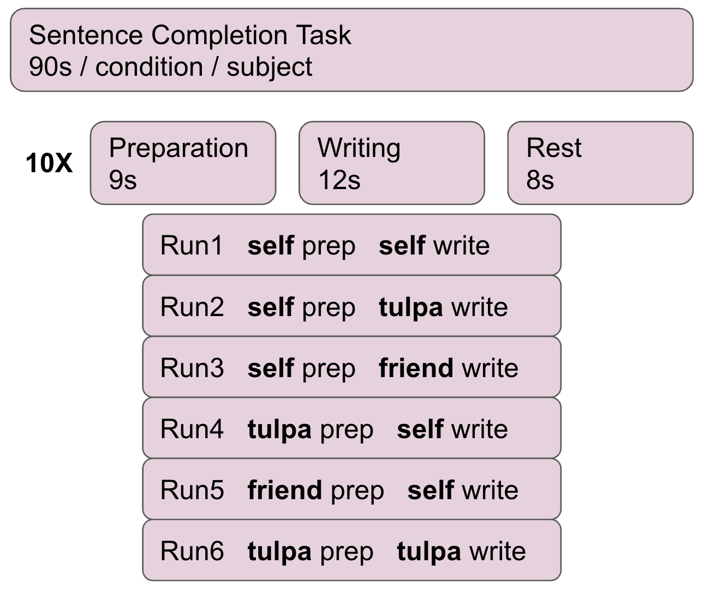
   
   <br /><sub><b>protocol of the sentence completion task</b></sub>
</div>


The data was preprocessed with [fmriprep](https://fmriprep.org/en/stable/) before any of the analyses were carried out. 

## Deliverables

In addition to the deliverables below, you can find a more extensive report of this project on this [website](https://jonasmago.github.io/brainhack2023/intro.html).


```{warning}
The date of publishing the final results on this [website](https://jonasmago.github.io/brainhack2023/intro.html) is depending on final confirmatino of the principal investigator of this study. 
```

You can also find all the code used for the results below in this [github repo](https://github.com/brainhack-school2023/jonas_project.git).

# Results

<div style="text-align: center; background-color: white; border: 1px solid #000; padding: 20px;">
   
</div>

## Progress overview

The [brainhack school](https://school-brainhack.github.io/) provided four weeks of space during which I could work full time on the analysis of this Tulpa dataset. At the end of these four weeks I was able to complete a first draft of all major analyses intended. These analyses include: 
* GLM (first and second level).
* Task related connectivity.
* ML classifier to differentiate conditions using the connectome;
* A deep learning decoding appraoch using PyTorch to distinguish the task conditions. 

## Tools I learned during this project

This project was intended to upskill in the use of the following
 * `Nilearn` to analyse fMRI data in python.
 * `Scikit-learn`to realise ML classification tasks on fMRI related measures.
 * `Py Torch` to implement a brain decoder.
 * `Jupyter {book}`and `Github pages`to present academic work online.
 * `Markdown`, `testing`, `continuous integration` and `Github` as good open science coding practices.

## Results

### Deliverable 1: project report 

You are currently reading the project report. 

### Deliverable 2: project website

In addition to this report, I made a [github website](https://jonasmago.github.io/brainhack2023/). However, please note that the website does not currently show the full report of this project as the publication is waiting for final approval from the Principal Investigator of this project. 
This project website was created using `Jupyter {books}`. This format allows for a potential submission to [neurolibre](https://neurolibre.org/). Neurolibre is a preprint server for interactive data analyses. 


### Deliverable 3: project github repository


The repository of this project can be found [here](https://github.com/mtl-brainhack-school-2019/ecg_pupillometry_pipeline_kaufmann). The objective was to create a processing pipeline for ECG and pupillometry data. The motivation behind this task is that Marcel's lab (MIST Lab @ Polytechnique Montreal) was conducting a Human-Robot-Interaction user study. The repo features:
 * a [video introduction](http://www.youtube.com/watch/8ZVCNeX42_A) to the project.
 * a presentation [made in a jupyter notebook](https://github.com/mtl-brainhack-school-2019/ecg_pupillometry_pipeline_kaufmann/blob/master/BrainHackPresentation.ipynb) on the results of the project.
 * Notebooks for all analyses.
 * Detailed requirements files, making it easy for others to replicate the environment of the notebook.
 * An overview of the results in the markdown document.

### Deliverable 4: GLM results

I have used `Nilearn` to compute a GLM that compares different conditions of the task. Specifically, I am interested in teh respective contrasts between **self**, **tulpa**, and **friend**. I am interested in these contrasts for the preparation and writing phase respectively. I have computed the GLM on fmriprep prepreocessed data. I have then created a design matrix that integrates the timing files (first two columes) as well as well as some movement regressors (see figure below). To incorporate the movement regressors I have used the `load_confounds_strategy` from nilearn with the following parameters: `denoise_strategy="scrubbing", motion="basic", wm_csf="basic"`. 
I have then computed a second level analysis that combines the individual beta maps into a group level contrast between the different conditions (see design matrix below). As a result I receive z-scores of each voxel, indicating how much that voxel differs across the two compared condition. The plot below displays these z-scores for comparing the self-write with the tulpa-write condition. A z-score of 3.0 is equivalent to a 99% confidence interval, a z-score of 2.3 is equivalent to a 95% confidence interval. 

<div style="text-align: center; background-color: white; border: 1px solid #000; padding: 20px;">
   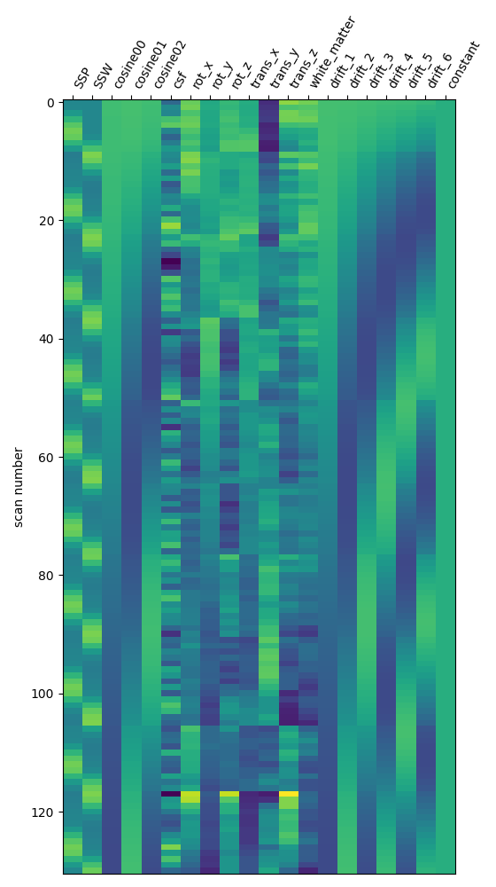
   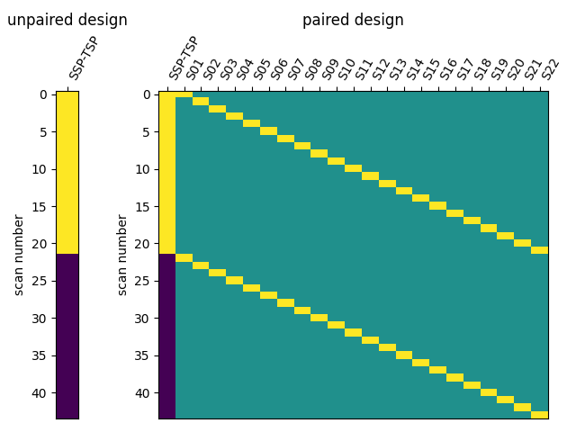
   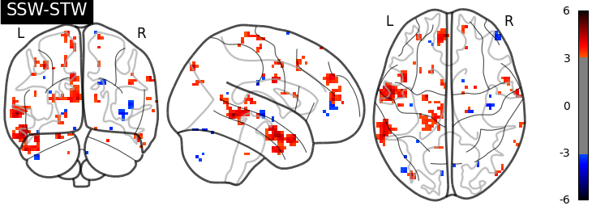
   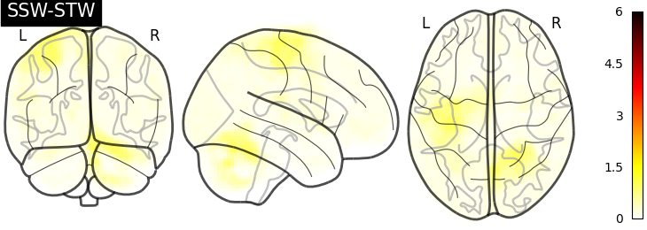
</div>

I then used [Neuro Maps](https://netneurolab.github.io/neuromaps/user_guide/nulls.html) to compute the pearson-r correlation between the first level outputs computed with Nilearn to those I previously computed with SPM. To test for the significance of these comparisons, I re-computed the pearson-r for random pairs. The r values of the true (matched) pairs have a mean of 61.32 while the mean of the random (unmatched) pairs is 17.09. A two-sample t-test revleaed that this difference is significant: **T-stat: -26.24** and a **p-value=0.000**. 

<div style="text-align: center; background-color: white; border: 1px solid #000; padding: 20px;">
   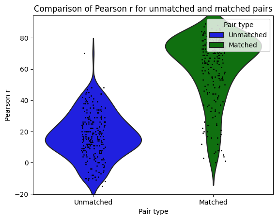
</div>

### Deliverable 4: Connectome results

I have parcellated the brain into 39 regions based on the [probabilistic msdl atlas](https://nilearn.github.io/dev/modules/generated/nilearn.datasets.fetch_atlas_msdl.html). A probabilistic atlas assigns a probability to each voxel, indicating how likely it is that that voxel belongs to a specific region. I have then computed the correlation between all of these 39 regions, resulting into a connectome of shape 39*39. Given that that the correlation measure is none directive, the upper and lower triangle of the connectome mirror each other. Below is an example of a connectome for one subject and one condition.

<div style="text-align: center">
   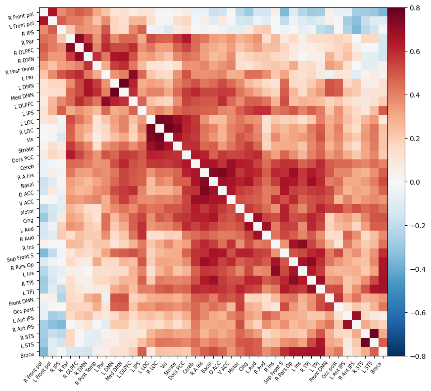
</div>

### Deliverable 4: Seed-to-Voxel connectivity results
I have previously computed a gPPI for this dataset using CONN. I wanted to replicate this task dependent seed to voxel correlation using Nilearn. I have specified the seed based on the group peak activation in the SMA, using the results from the SPM and Randomise analysis. Seed coordination in MNI space are `(-4, 12, 55)`. I have then constructed a sphere around this voxel with a radius of 5 mm. Using this ROI, correlations to all voxels based by task condition were computed. Below is an illustrative example of the connectivity values for one subject and one condition.

<div style="text-align: center">
   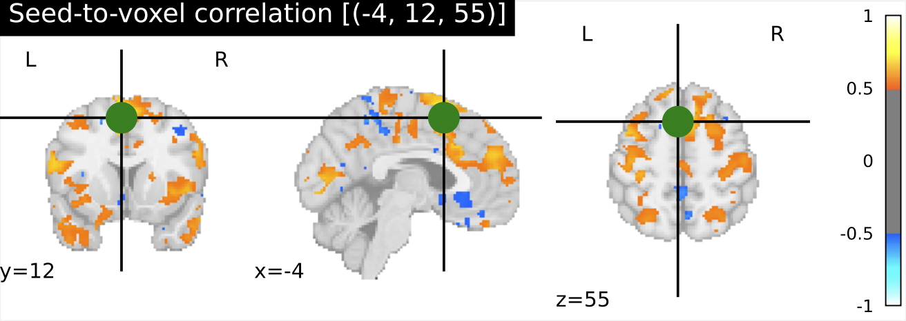
</div>

### Deliverable 4: ML-classifier results

The aim was to train a classifier that can accurately distinguish between different task conditions. I used a majority vote ensemble classifier that combines `LogisticRegression`, `RandomForestClassifier`, and a `SVC`. When classifying the conditions `prep` vs. `write`, the classifier achievs an acciracy of ~80%, so well above chance. However, this is not surprising as the writing conditions will have muhc stronger motor cortex activation and the two conditions are quite different. I then classified the `self`, `tulpa`, and `friend` conditions for preparation and writing respectively. In both conditions, we have an accuracy of ~51% for this 3-group classification problem. Given the three groups, chance levels are at 33.3%, thus an accuracy of 51% is well above chance, YAY!


**prep-write condition**
> average accuracy = 0.76
> p-value (on 100 permutations): p=0.00
<div style="text-align: center">
   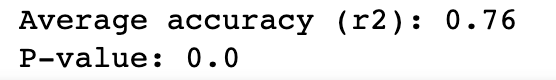
   <br/>
   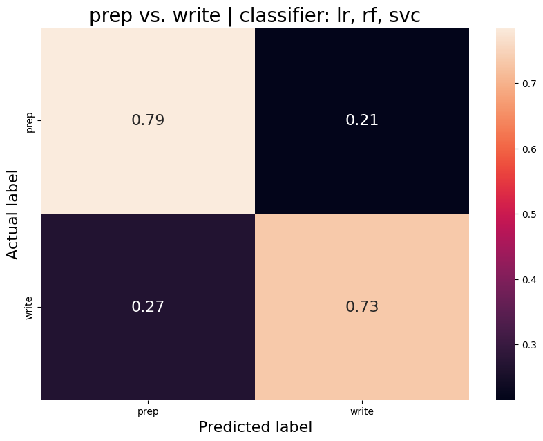
   <br/>
   
   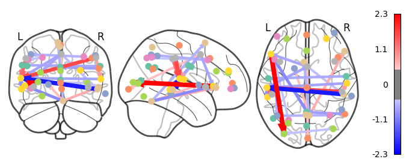
   <br /><sub><b>prep-write condition</b></sub>
</div>

<div style="text-align: center">
   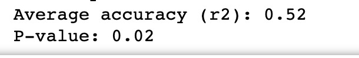
   <br/>
   
   <br/>
   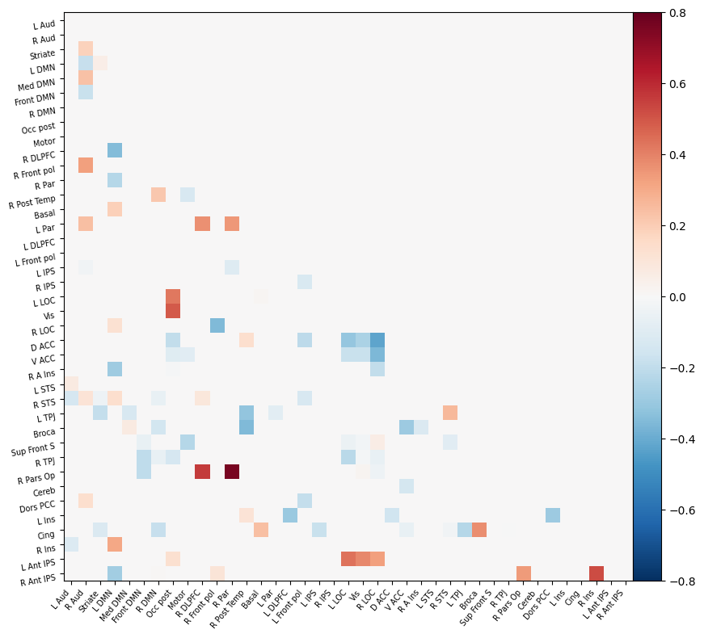
   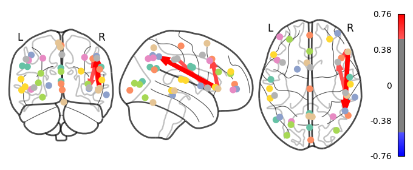
   <br /><sub><b>write condition</b></sub>
</div>

<div style="text-align: center">
   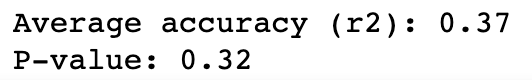
   <br/>
   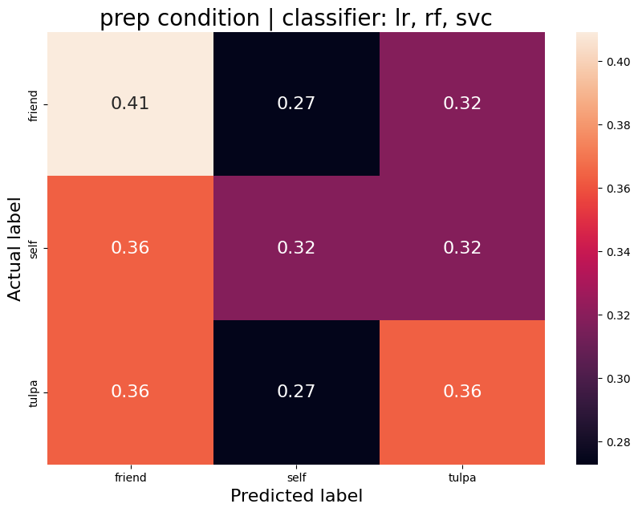
   <br/>
   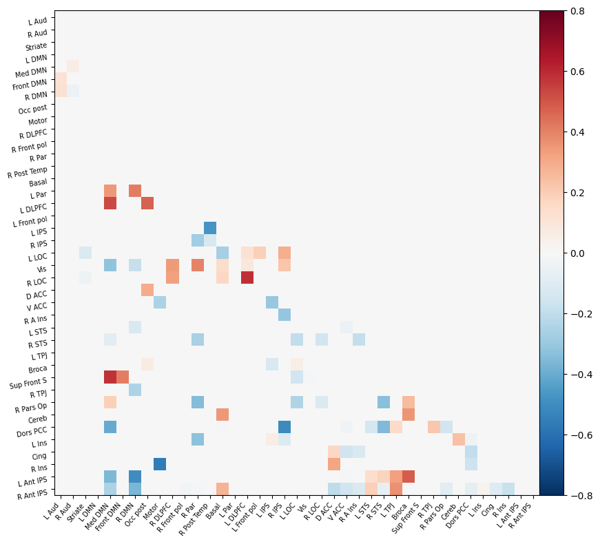
   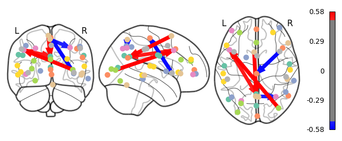
   <br /><sub><b>prep condition</b></sub>
</div>

### Deliverable 4: Deep neural network encoding results

<div style="text-align: center">
   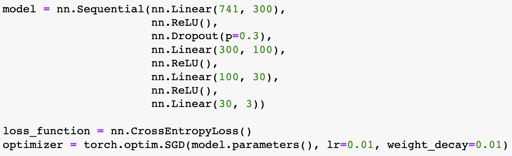
   <br/>
   
   <br/>
   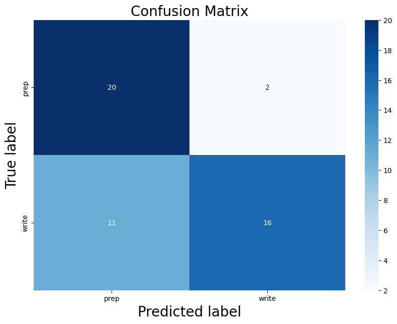
   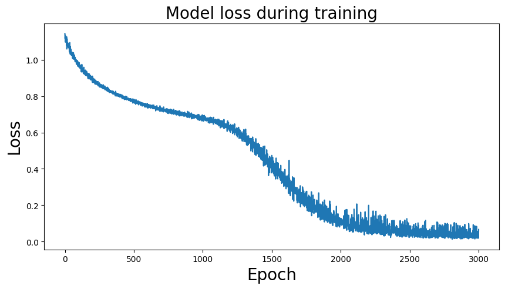
   
   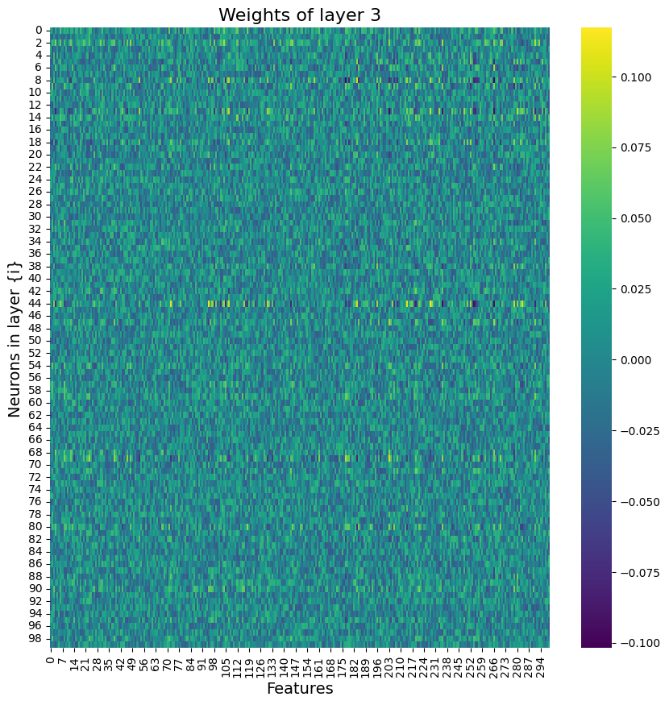
   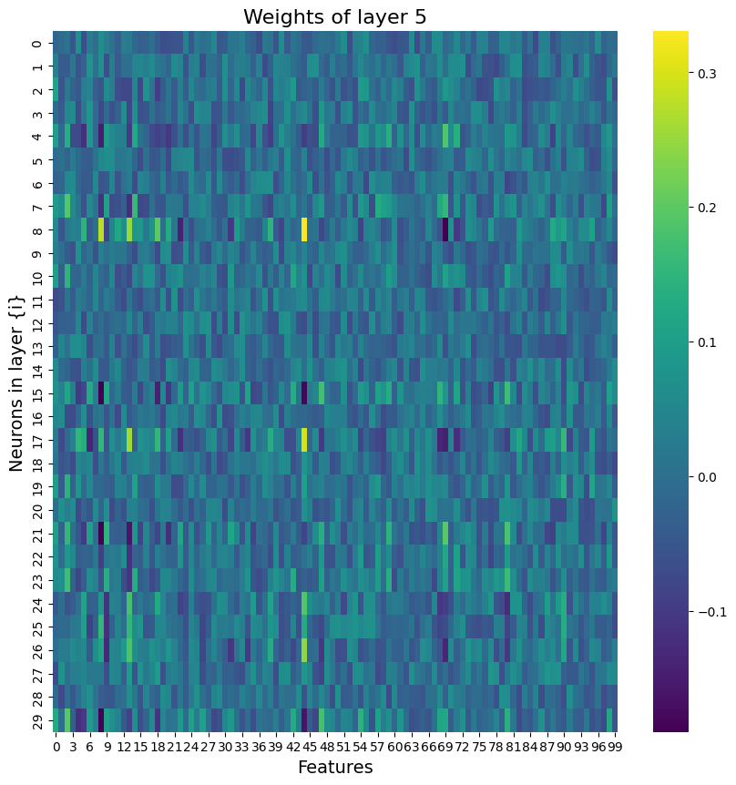
   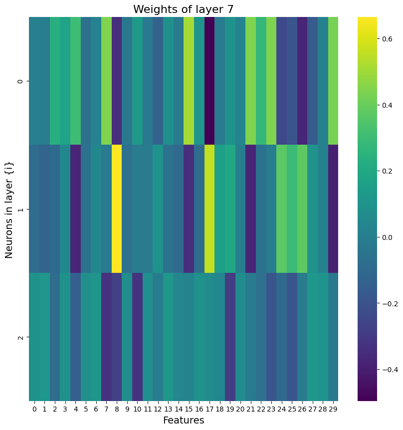
   <br /><sub><b>results of the neural network</b></sub>
</div>

## My to-do list 
* [X] preprocess the fMRI data with fmriprep
* [X] run GLMs using SPM for the first level and FSL Randomise for the second level 
* [X] replicate GLM in Nilearn 
   * [X] replicate a GLM in Nilearn 
   * [X] compute the correlation between first-level beta maps in the SPM and Nilearn analysis 
   * [ ] replicate the Nilearn GLM with the exact same parameters as in SPM 
      * fd_threshold = 1 (default is 0.5mm)
      * change from `load_confound_strategy` to `load_confound`as it's more custamizable and allows to match parameters of SPM.
      * check if I used a high pass filter in SPM, if not deactivate it in Nilearn.
      * check if I standardized in SPM, if not deactivte it in Nilearn.
   * [ ] Cluster correct the Nilearn second-level contrasts using [`cluster_level-inference`](https://nilearn.github.io/dev/modules/generated/nilearn.glm.cluster_level_inference.html#nilearn.glm.cluster_level_inference).
   * [ ] re-run the GLMs including a brain mask that excludes the cerebellum and brain stem. As we are not interested in the analysis of these regions their exclusion is legit. I can use a mask from brainvolt that I can [download here](https://neurovault.org/collections/6196/).
* [X] connectivity analysis 
   * [X] compute connectome for all conditions and save as `.npy`
   * [ ] compute `graph theory` metrics to characterise and compare the connectomes. François Paugam recommended to look into the [Networks of the Brain](http://www.cs.cmu.edu/~saketn/files/Sporns_Book.pdf) as an introduction.
* [X] compute seed-to-voxel correlations 
* [X] ML classifier 
   * [X] ML classifier on connectomes 
   * [ ] ML classifier on seed-to-voxel maps 
   * [ ] ML classifier on the average activity for each of the 10 trials (not entire runs) cropped to an ROI in the SMA
* [X] Deep Neural Network Decoder using PyTorch

## Feedback from the final presentation 
- visualise things in MRIcroGL, soon implemented in nilearn as `niview`
- change my pearson-r values to [-1, 1] (currently [-100,100])
- for comparing nilearn and spm beta maps: specify not-matched. E.g.:
   - between software, within subject, within contrast, within run 
   - between software, between subject, between contrast, between run 
- feature selection must be either on (A) train set or (B) integrated in cross-validation. Make sure it's not selecting featuers on the entier dataset --> danger of overfitting!
- r2 is a measure for the percentage of variance explained. Not relevant here, thus, remove it. 
- explain permutation test for significance testing.
- apply the classifer on beta maps per trials (there are 10 trials per run). I can use ROIs or entire beta masks. The model will take care of the many variables. 
- try a searchlight appraoch: train a classifer on different ROIs or voxels and then compare the accuracy. This could lead to a accuracy map with voxel resolution, however, this is computationally expensive. 
- it's important to  **de-mean** my data before doing this (e.g. use z-score). 
- look into **stratified cross validation** to deal with multiple runs per subject in the classifier. If I use stratification this shouldn't be a problem. 


## Tipps and Tricks, useful hacks, and notes for next iterations of this project 
- Plotting results
   - [plotly](https://plotly.com/)
   - histograms are powerful because they don't collapse either time or space 
   - raindrop plots are powerful as they show all individual points 
   - examples in the [python graph gallery](https://www.python-graph-gallery.com/)
- Python virtual environment
   - To make and actiavte a python virtual environment, use the following two lines:
      - `python3 -m venv venv`
      - `source venv/bin/activate`
   - To generate a `requirements.txt` file
      - Option 1: `pip freeze`.
      - Option 2: [Pipreqs](https://pypi.org/project/pipreqs/) automatically detects what libraries are actually used in a codebase. 
- Python local pip install 
   - make sure to have an __init__.py file in the src directory 
   - also make sure to have a setup.py file
   - Navigate to root directory and run: `pip install -e .`
- Python ipykernal allows to install kernals from python and conda environments 
   - `python -m ipykernel install --user --name=<my_env>`
- VIM: create and edit python files in the Terminal
   - `vim <file name>.py` 
   - `%s` search and replace
   - `i` insertion mode
   - doesn't leave a mess in the terminal after closing
   - alternative to `vim` is `nano`
- [Cookiecutter](https://www.cookiecutter.io/templates) as template for repos. 
   - [Teamplate for neuroimaging](https://github.com/patrickmineault/true-neutral-cookiecutter).
- Debugging scripst
   - `breakpoint()`can replace `import pdb; pdb.set_trace()``
   - `python -m pdb <script name>` runs a script with pdb. press `c` for continue when the script is loaded. This will allow you to be in the pdb when the code crashes. 
- [Neuro Maps](https://netneurolab.github.io/neuromaps/user_guide/nulls.html) allows to compare the pearsonr and p-value between two nifti files 
- The [Good Research Blog](https://goodresearch.dev/setup.html#install-a-project-package) shows how to do a local pip install (and much more)
- writing good code 
   - github copilot 
   - [sourcery](https://sourcery.ai/) automatically suggests improvements 
   - can I describe the function in **one** line

## About the Author
- `Name`: Jonas Mago
- `Contact`: jonas.h.mago@gmail.com
- `Affiliation`: McGill University
- `Background`: My background is in neuroimaging (EEG, fMRI), cognitive sciecnes, Active Inference, and Philosophy. After a BA in Liberal Arts and Sciences at the University College at Maastricht University and an MSc in Mind, Language, and Embodied Cognition at the University of Edinburgh, I am now pursuing my PhD at McGill University. 
- `General Interests`: I am using the Active Infernece framework to study the predictive and bayesian mechanics undrelying contemplative practices such as prayer, meditation, and psychedlics. Specifically, I work with (A) expert meditators from the Theravaden tradition that are able to enter absorption states called Jhana at will, (B) Charismatic Christian Prayer practitioners, and (C) experiences of entity encounters under the influnece of DMT. 

<div style="text-align: center;">
<a href="https://github.com/jonasmago">
   
   <br /><sub><b>Jonas Mago</b></sub>
</a>
</div>

## Acknowledgement

<div style="text-align: center;">
   <a href="https://jonasmago.com">
      
   </a>
</div>